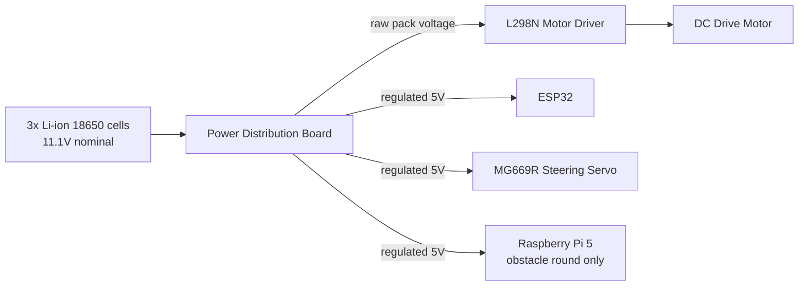
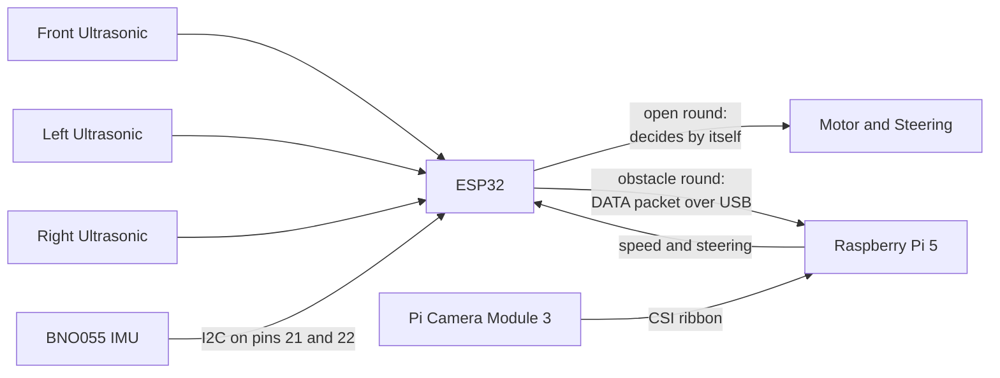
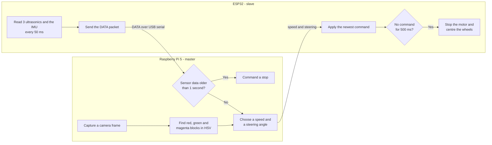

# ERROR 404 — WRO Future Engineers 2026

GitHub repository and vehicle design for Team ERROR 404.

---

## Table of Contents

- [Overview](#overview)
- [Repository Structure](#repository-structure)
- [Key Features](#key-features)
- [Key Folders](#key-folders)
- [Meet the Team](#meet-the-team)
- [Hardware](#hardware)
  - [Open Challenge Round](#open-challenge-round)
  - [Obstacle Challenge Round](#obstacle-challenge-round)
- [Mobility System](#mobility-system)
- [Power System](#power-system)
- [Sensor Integration](#sensor-integration)
- [Software](#software)
  - [Development Environment](#development-environment)
  - [Libraries and Dependencies](#libraries-and-dependencies)
  - [Open Round: How the Code Works](#open-round-how-the-code-works)
  - [Obstacle Round: How the Code Works](#obstacle-round-how-the-code-works)
  - [Failure Handling](#failure-handling)
  - [Getting the Code Running](#getting-the-code-running)
  - [Tuning and Testing Tools](#tuning-and-testing-tools)

---

## Overview

This repository holds the hardware, the software and all the supporting material for both challenge rounds of the WRO Future Engineers 2026 competition.

**Open Challenge Round.** A single ESP32 runs the whole vehicle. It reads the ultrasonic sensors and the IMU and drives the motor and steering by itself, using Arduino IDE compatible code built around a wall following algorithm.

**Obstacle Challenge Round.** The vehicle switches to a two controller setup, where the Raspberry Pi is the master and the ESP32 is the slave. The ESP32 stops making decisions and becomes a sensor board: it reads everything and passes it up to the Pi. The Pi is the brain, combining that sensor data with the live camera feed to decide where the vehicle should go, then sending speed and steering commands back down.

---

## Repository Structure

| Directory | What is inside |
|:----------|:---------------|
| [`src/`](./src/) | All of our source code, split into `open_round/` and `obstacle_round/`. Each round also keeps the small test programs we wrote while getting the hardware working. |
| [`models/`](./models/) | The STL files for every part we 3D printed, including the chassis plates, the sensor mounts and the camera mount. |
| [`schemes/`](./schemes/) | The electrical schematics, one for each round, showing how every component is wired. |
| [`t-photos/`](./t-photos/) | Photos of the team, and our logo. |
| [`v-photos/`](./v-photos/) | Photos of the finished vehicle from the front, the rear, both sides and the top. |
| [`video/`](./video/) | Links to our driving test footage. |
| [`docs/`](./docs/) | Engineering documentation for the build. |

---

## Key Features

**Full documentation of both the hardware and the software.** Every component, every wire and every part of the code is written up, so anyone reading this repository can understand how the vehicle works and rebuild it themselves rather than guessing at our design.

**3D models included.** All of our printed parts are in the repository as STL files, so you can rebuild the same vehicle without having to design anything yourself in Fusion 360, Tinkercad or SolidWorks.

**Built for the competition.** The code and the schematics cover both the Open Round and the Obstacle Round, and both are set up for the WRO Future Engineers rules rather than being a general robotics demo.

---

## Key Folders

**[`src/`](./src/)** — The complete source code. `open_round/` has the single ESP32 sketch that runs the wall following routine. `obstacle_round/` has the ESP32 sensor and motor firmware together with the Raspberry Pi vision and navigation program. Both rounds also include a `testing_calibration_codes/` folder with the smaller programs we used to check the hardware before running the full code.

**[`models/`](./models/)** — Every 3D printed part on the vehicle, saved as STL so it can go straight into a slicer.

**[`schemes/`](./schemes/)** — The wiring diagrams. There is one schematic per round, because the obstacle round adds the Raspberry Pi and the camera on top of the open round electronics.

**[`v-photos/`](./v-photos/)** — Photographs of the finished vehicle from every angle. These are meant to be used as a construction reference, so you can see how components are actually positioned and routed rather than working from the schematic alone.

---

## Meet the Team

Our team has three members:

| Member | Grade |
|:-------|:------|
| Ayansh Paliwal | Grade 9 |
| Anvay Varshney | Grade 10 |
| Rohan Mishra | Grade 10 |

We come from two different schools, The International School Bangalore and National Public School Koramangala, which meant most of our work had to be planned properly instead of happening in the same room. We used a project planning tool called Linear to keep track of tasks and split the work between software, hardware, 3D design and documentation, so everyone knew what they were responsible for and nothing got forgotten between meetings.

---

## Hardware

Before building anything, we decided on our hardware requirements and our bill of materials. Every component on this list is there to do a specific job, and each choice had a reason behind it rather than being whatever we had lying around.

### Open Challenge Round

| Component | What it does |
|:----------|:-------------|
| **ESP32 Dev Board** | The only controller in this round. It does all of the processing and drives every sensor, the servo and the motor. |
| **DC Drive Motor** | Rear wheel drive, controlled through the L298N driver. |
| **MG669R Steering Servo** | Front wheel steering. A high torque servo is worth using here, because the steering has to hold its angle while the vehicle is moving. |
| **Ultrasonic Sensors (x3)** | Mounted at the front, the left and the right to measure the distance to the walls on each side. |
| **BNO055 IMU** | A 9-axis absolute orientation sensor. It gives us a real heading rather than a raw gyro rate, so the vehicle can hold a straight line and know when it has actually completed a 90 degree turn. |
| **L298N Motor Driver** | Takes the low power signals from the ESP32 and switches the current the drive motor needs, in both directions. |
| **Power Distribution Board** | Splits the battery power into separate branches, so the electronics get a regulated 5V supply and the motor gets the raw pack voltage. |
| **Li-ion Batteries (x3)** | Three cells in series power the whole vehicle, at about 11.1V nominal. |

### Obstacle Challenge Round

| Component | What it does |
|:----------|:-------------|
| **Raspberry Pi 5 (4GB)** | The brain and the master controller. It runs the vision system and makes every driving decision. |
| **Raspberry Pi 5 Active Cooler** | Keeps the Pi from overheating. Running the camera and OpenCV together pushes the processor hard, and a hot Pi throttles itself and slows the whole loop down. |
| **ESP32 Dev Board** | The slave controller. In this round it only reads the sensors and drives the motor and servo, taking its orders from the Pi. |
| **Raspberry Pi Camera Module 3 (Wide)** | The vision input, mounted at the front on a 3D printed mount. The wide lens matters because it lets the vehicle see traffic signs that are off to the side. |
| **DC Drive Motor** | Rear wheel drive, same as the open round. |
| **MG669R Steering Servo** | Front wheel steering, same as the open round. |
| **Ultrasonic Sensors (x3)** | Wall distance measurement at the front, left and right. |
| **BNO055 IMU** | Orientation and heading, read by the ESP32 and passed up to the Pi. |
| **L298N Motor Driver** | Drives the rear motor. |
| **Power Distribution Board** | Branches the battery power out to the different systems, with regulated 5V on some pads and the raw pack voltage on others. |
| **Li-ion Batteries (x3)** | Power for the whole system, including the Pi. |

---

## Mobility System

**Steering.** The two front wheels are steered by a high torque MG669R servo through a steering linkage.

**Drive.** A DC motor drives the two rear wheels, so steering and power are handled separately and neither has to compromise for the other.

**Turning radius.** We found this by testing rather than by calculating it. We kept adjusting the steering limits and running the vehicle until we found the sharpest turn it could make without the wheels binding or the vehicle scrubbing across the mat.

**Control.** In the open round the ESP32 generates the PWM for both the servo and the motor directly. In the obstacle round the Raspberry Pi decides on a speed and a steering angle and sends them to the ESP32, which then generates the same PWM signals. The mechanical system does not change between rounds, only what is deciding the numbers.

**Design rationale.** We used Ackermann steering, which is the geometry real cars use. When a car turns, the inside wheel is following a tighter circle than the outside wheel, so if both wheels are turned by the same angle one of them has to scrub sideways across the ground. Ackermann geometry turns the inside wheel further than the outside wheel so that both roll cleanly around the same centre point. For us that meant sharper, more predictable turns and less fighting against our own tyres.

---

## Power System

The vehicle runs on three Li-ion cells in series, which gives about 11.1V nominal, or around 12.6V when they are fully charged.

That pack feeds a power distribution board, which is what lets one battery pack run everything safely. The board splits the supply into two kinds of output: a regulated 5V branch and a branch carrying the raw pack voltage.

The 5V branch runs the ESP32, the sensors, the steering servo and the Raspberry Pi. The raw pack voltage goes to the motor driver, which is the only part that wants the higher voltage.

One thing worth knowing if you rebuild this: the Raspberry Pi 5 is fussy about its 5V supply. If the current available drops it will reboot in the middle of a run, which is very hard to diagnose if you assume it is a software problem.

---

## Sensor Integration

**Ultrasonic sensors (x3).** Mounted at the front and on both sides. They measure how far away the walls are, which is what the vehicle uses to stay centred in the lane and to recognise that it has arrived at a corner.

**BNO055 IMU.** This gives us real time orientation. Small steering errors and wheel slip would otherwise build up over three laps until the vehicle is driving at an angle, so the heading from the IMU is used to correct that drift continuously and to confirm that each 90 degree turn has actually finished.

**Camera (obstacle round only).** An OpenCV compatible Raspberry Pi 5 camera mounted at the front, giving the Raspberry Pi a live video feed. This is what the vehicle uses to find the red and green traffic sign pillars and the magenta parking limiters, none of which an ultrasonic sensor can tell apart.

Every sensor except the camera is wired to the ESP32, in both rounds. What changes between rounds is who reads the ESP32.

---

## Software

The two rounds do not share a program, because they do not share a problem. The open round is about staying centred between walls that never move, and one microcontroller is enough for that. The obstacle round adds coloured pillars that have to be passed on a specific side, which needs a camera, and a camera needs a computer. So the software is split into two codebases that happen to drive the same chassis.

### Development Environment

| Part | Language | Written and flashed with |
|:-----|:---------|:-------------------------|
| ESP32 (both rounds) | C++ / Arduino | Arduino IDE 2.0 or newer, with the ESP32 board package by Espressif Systems |
| Raspberry Pi (obstacle round) | Python 3 | Any editor, run from the terminal on Raspberry Pi OS 64-bit |

The ESP32 is programmed as an **ESP32 Dev Module** at 115200 baud, which is also the baud rate the two controllers talk to each other on.

### Libraries and Dependencies

**On the ESP32:**

| Library | Why it is needed |
|:--------|:-----------------|
| `ESP32Servo` | Generates the servo PWM. The standard Arduino `Servo` library does not work on the ESP32. |
| `Adafruit BNO055` | Talks to the IMU and gives us Euler angles instead of raw sensor values. |
| `Adafruit Unified Sensor` | Required by the BNO055 library. |
| `Wire` | I2C, already included with the Arduino IDE. |

**On the Raspberry Pi:**

| Library | Why it is needed |
|:--------|:-----------------|
| `picamera2` | Captures frames from the Camera Module 3. Pre-installed on Raspberry Pi OS. |
| `opencv-python` | Colour conversion, thresholding, contour finding and the debug preview window. |
| `numpy` | The HSV bounds and all the array work OpenCV depends on. |
| `pyserial` | The USB serial link down to the ESP32. |

### Open Round: How the Code Works

Everything runs on the ESP32 in a single loop, and the whole strategy is built on one idea: the walls tell you where you are, and the IMU tells you which way you are facing.

On boot the code centres the servo, starts I2C, puts the BNO055 into NDOF mode and zeroes the heading, then waits on the start button. It also records the front distance at the moment it starts, which is what it later uses to recognise the starting position again.

In the main loop it reads the heading and all three distances, and then decides between four cases:

- **Too close to a wall in front** (under 22 cm) — reverse until there is at least 40 cm of room again, with a 1.5 second cap so it can never get stuck reversing.
- **A corner is coming up** (front under 65 cm, one side open past 85 cm and the other side closed) — reverse briefly to make room, then run the turn routine for whichever side is open.
- **Otherwise** — drive forward and hold the target heading, steering by the difference between the current yaw and the heading it is supposed to be on.

Lap counting works by counting turns rather than by timing. The first lap is used to learn how many turns a lap actually takes, and after that the count is used to track laps. Once three laps are done the vehicle switches into a return-to-start mode, drives until the front distance matches the distance it recorded at the beginning, creeps forward for another moment and stops.

### Obstacle Round: How the Code Works

**Division of labour.** The ESP32 stops making decisions entirely. It reads the three ultrasonic sensors and the BNO055 every 50 ms, pushes them up to the Pi, and applies whatever speed and steering angle comes back. The Pi runs the camera, finds the pillars, and decides everything. Neither side does the other's job: the Pi never touches a sensor pin, and the ESP32 never sees a camera frame.

**The link between them.** Commands going down are one line of text, `speed,steering`, where speed is -255 to 255 and steering is 30 to 150 with 90 being straight. Data coming up is a `DATA` line with the three distances, the heading and the four BNO055 calibration values. The Pi handles serial on a background thread so that waiting for the port never stalls the camera loop, and it rate limits commands to 20 per second so the ESP32's input buffer cannot fill up faster than it drains.

**Seeing the pillars.** Each frame is converted to HSV, because HSV separates "what colour is this" from "how brightly lit is it" far better than RGB does, which matters when the venue lighting is not the lighting we practised in. Separate thresholds pull out red pillars, green pillars and the magenta parking limiters. Contours smaller than our minimum area are thrown away so that specks of noise are not treated as pillars.

**Deciding where to go.** The WRO rule is that red pillars are passed on the right and green on the left, so colour decides the direction. Distance decides the urgency: a pillar's apparent area tells us roughly how close it is, and the steering angle is scaled from about 10 degrees for a distant pillar up to 60 degrees for one that is nearly on top of us. Where the pillar sits in the frame adjusts that slightly, with a pillar dead ahead getting a firmer push than one already drifting off to the correct side. A pillar right at the edge of the frame is ignored, because the vehicle is already going to miss it and steering again would only throw the line away.

With no pillars in sight the vehicle goes back to holding its heading off the IMU, exactly like the open round does.

**Corners.** A corner turn is only allowed when the frame is completely clear of pillars, the front sensor is inside 60 cm, and one side is open while the other is closed. There is one more rule that took us a while to arrive at: the vehicle has to have gone around at least one pillar since its last turn. Without that, it would sometimes take two turns in the same corner and lose the lap count. The turn itself comes in two shapes chosen by how much room is on the far side — a forward-then-reverse manoeuvre when there is space, and a single forward arc when there is not. Either way the IMU decides when the turn is finished, and afterwards the heading is snapped to the nearest 90 degrees so that a degree of error per corner does not become twelve degrees by the end of the run.

**Parking.** The vehicle starts inside the parking lot, so the run opens with a short scripted exit: turn away from the wall, counter-steer, straighten, and begin the laps. After twelve counted turns it goes looking for the magenta limiters, and only commits to parking once it has seen one convincingly across several frames rather than in a single lucky one. It then drives past the first limiter, reverses into the bay in two steering stages, and finally checks its own work by confirming its heading and its distance from the wall before declaring itself parked.

### Failure Handling

Most of what went wrong during testing was not the vehicle making a bad decision, it was the vehicle making a decision on information that was no longer true. Three things guard against that:

- **The ESP32 watchdog.** If no command arrives for 500 ms, the ESP32 stops the motor and straightens the wheels on its own. A loose USB cable or a crashed program now means a stopped vehicle instead of one that keeps driving on its last instruction.
- **The stale data check.** If the sensor or IMU readings on the Pi are more than a second old, the Pi commands a stop rather than steering off numbers that may no longer describe reality.
- **Phase timeouts.** Every stage of a turn and of the parking sequence has a time limit, so a manoeuvre that never completes gives up instead of running forever.

Every run also writes a timestamped log file and records an annotated video showing the detected pillars, the steering angle and the internal state, which is how we worked out what the vehicle was thinking after a run rather than guessing from the outside.

### Getting the Code Running

**Open round:** open `src/open_round/Open_Round.ino`, install the four libraries listed above, select ESP32 Dev Module, upload, then press the start button.

**Obstacle round:**

1. Flash `src/obstacle_round/ESP_Code_Slave.ino` to the ESP32 and check the serial monitor prints `ESP32_V2_READY` and `BNO055_READY`.
2. On the Pi, install the dependencies and add yourself to the `dialout` group so the serial port is usable.
3. Confirm which port the ESP32 came up on with `ls /dev/ttyUSB*` and set `SERIAL_PORT` to match.
4. Point `LOGS_DIR` at a folder that exists on your Pi.
5. Run `python3 Raspberry_Pi_Code_Master.py`. It will sit and wait.
6. Press the button on the ESP32. That is what starts the run.

Full step-by-step instructions live in the round folders: [`src/open_round/README.md`](./src/open_round/README.md) and [`src/obstacle_round/README.md`](./src/obstacle_round/README.md), the second of which also contains the control flow diagrams for the whole system.

### Tuning and Testing Tools

Each round keeps its bring-up tools in a `testing_calibration_codes/` folder, because debugging the full program when you are not sure the hardware works is a waste of an afternoon.

- **`Full_Bot_Sensor_and_Motor_Test.ino`** (open round) sweeps the servo, cycles the drive motor and prints every sensor, so a wiring mistake shows up in seconds.
- **`rx_tx_test.ino`** (obstacle round) is a serial echo test that proves the Pi and the ESP32 can talk before any driving logic is involved.
- **`hsv_tuner.py`** (obstacle round) shows the camera feed, the detection mask and the filtered result side by side with live sliders for the HSV bounds. The WRO rules point out that real field colours differ from the printed specification, and teams get practice time at the venue for exactly this reason, so being able to re-tune the thresholds in a couple of minutes is worth far more than any value we could hard-code at home.
