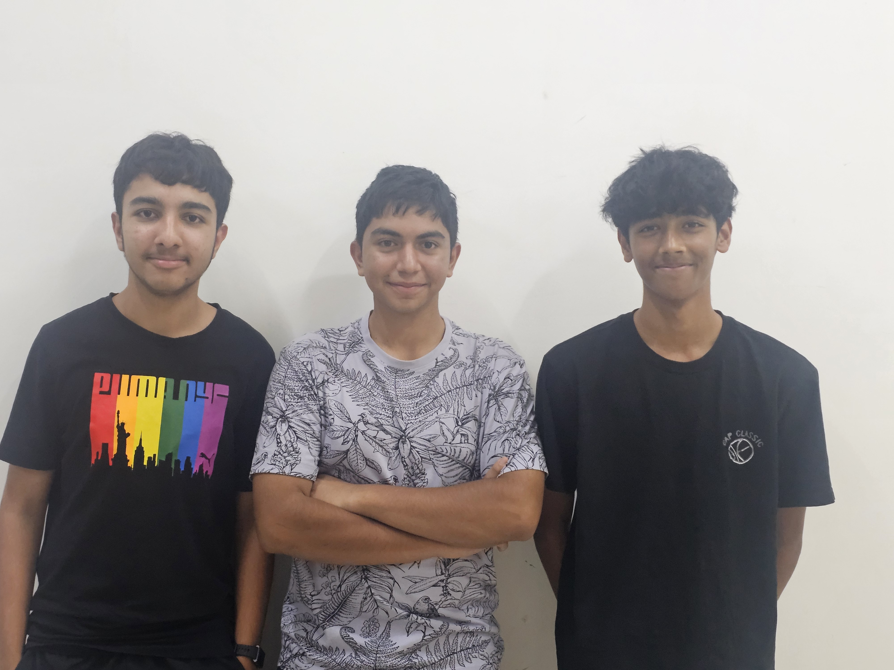

# ERROR 404 — WRO Future Engineers 2026

GitHub repository and vehicle design for Team ERROR 404.

This is the whole story of our car: what we built, why we built it that way, what we got wrong on the first try, and everything anyone would need to build it again from scratch.

---

## Table of Contents

1. [Overview](#overview)
2. [Meet the Team](#meet-the-team)
3. [Design Process](#design-process)
4. [Repository Structure](#repository-structure)
5. [Mobility Management](#mobility-management)
   - [Chassis](#chassis)
   - [Assembly Instructions](#assembly-instructions)
   - [Drive Motor and Transmission](#drive-motor-and-transmission)
   - [Steering Mechanism](#steering-mechanism)
   - [Wheels](#wheels)
   - [3D Printed Parts](#3d-printed-parts)
6. [Power and Sense Management](#power-and-sense-management)
   - [Power Supply](#power-supply)
   - [Switches and Starting a Run](#switches-and-starting-a-run)
   - [Controllers](#controllers)
   - [ESP32 Pin Mapping](#esp32-pin-mapping)
   - [Sensors](#sensors)
   - [Camera](#camera)
   - [Schematics](#schematics)
   - [Components List](#components-list)
7. [Competition Constraints](#competition-constraints)
8. [Engineering Trade-offs](#engineering-trade-offs)
   - [Ackermann Steering vs. Differential Steering](#ackermann-steering-vs-differential-steering)
   - [Funduino Wheels](#funduino-wheels)
   - [Ultrasonic Sensor Placement](#ultrasonic-sensor-placement)
   - [100 RPM vs. a Faster Drive Motor](#100-rpm-vs-a-faster-drive-motor)
   - [PLA vs. PETG for the Drive Shafts](#pla-vs-petg-for-the-drive-shafts)
   - [Li-ion Cells vs. a LiPo Pack](#li-ion-cells-vs-a-lipo-pack)
   - [One Battery Domain vs. Two](#one-battery-domain-vs-two)
   - [Vision Only vs. Vision Plus Ultrasonics and IMU](#vision-only-vs-vision-plus-ultrasonics-and-imu)
   - [1080p vs. 640x480 Vision Pipeline](#1080p-vs-640x480-vision-pipeline)
   - [Two Controllers vs. One](#two-controllers-vs-one)
9. [Software](#software)
   - [Software Building Blocks](#software-building-blocks)
   - [Development Environment](#development-environment)
   - [Programming Languages](#programming-languages)
   - [Libraries and Dependencies](#libraries-and-dependencies)
   - [Open Round: How the Code Works](#open-round-how-the-code-works)
   - [Obstacle Round: How the Code Works](#obstacle-round-how-the-code-works)
   - [Failure Handling](#failure-handling)
   - [Getting the Code Running](#getting-the-code-running)
   - [Tuning and Testing Tools](#tuning-and-testing-tools)
10. [Vehicle Photos](#vehicle-photos)
11. [Demonstration Videos](#demonstration-videos)
12. [Resources and Acknowledgements](#resources-and-acknowledgements)

---

## Overview

This repository holds the hardware, the software and all the supporting material for both challenge rounds of the WRO Future Engineers 2026 competition.

**Open Challenge Round.** A single ESP32 runs the whole vehicle. It reads the ultrasonic sensors and the IMU and drives the motor and steering by itself, using Arduino IDE compatible code built around a wall following algorithm.

**Obstacle Challenge Round.** The vehicle switches to a two controller setup, where the Raspberry Pi is the master and the ESP32 is the slave. The ESP32 stops making decisions and becomes a sensor board: it reads everything and passes it up to the Pi. The Pi is the brain, combining that sensor data with the live camera feed to decide where the vehicle should go, then sending speed and steering commands back down.

Three things we tried to get right in this repository:

**Full documentation of both the hardware and the software.** Every component, every wire and every part of the code is written up, so anyone reading this repository can understand how the vehicle works and rebuild it themselves rather than guessing at our design.

**3D models included.** All of our printed parts are in the repository as STL files, so you can rebuild the same vehicle without having to design anything yourself in Fusion 360, Tinkercad or SolidWorks.

**Built for the competition.** The code and the schematics cover both the Open Round and the Obstacle Round, and both are set up for the WRO Future Engineers rules rather than being a general robotics demo.

---

## Meet the Team

Our team has three members:

| Member | Grade |
|:-------|:------|
| Ayansh Paliwal | Grade 9 |
| Anvay Varshney | Grade 10 |
| Rohan Mishra | Grade 10 |

We come from two different schools, The International School Bangalore and National Public School Koramangala, which meant most of our work had to be planned properly instead of happening in the same room. We used a project planning tool called Linear to keep track of tasks and split the work between software, hardware, 3D design and documentation, so everyone knew what they were responsible for and nothing got forgotten between meetings.

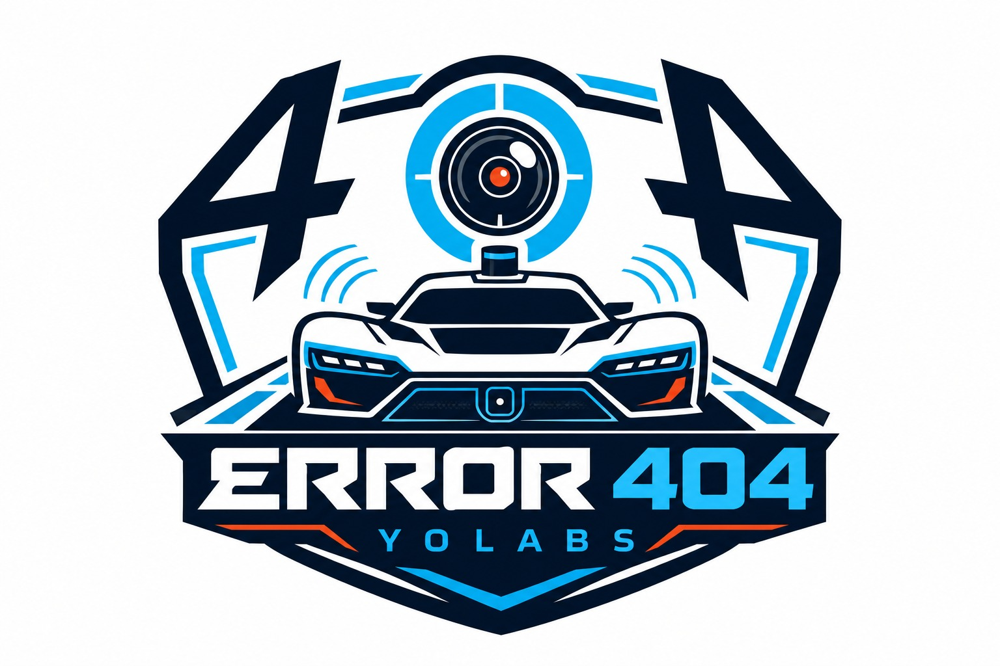

---

## Design Process

We kept two engineering documents while building the car, and they are the honest version of how this went rather than the tidy version.

- **[`docs/Decisions.md`](./docs/Decisions.md)** — every significant choice we made, in the order we made it, with the reasoning behind it. A couple of them we got wrong the first time and had to change later, and we left those in.
- **[`docs/Testing.md`](./docs/Testing.md)** — the testing log: what we tried, what broke, and what the fix was.
- **[`docs/Engineering_Journal.pdf`](./docs/Engineering_Journal.pdf)** — the full engineering journal submitted for the competition, covering the whole design, build and testing process with the measurements and test data behind each decision.

The short version of the process: decide what the car has to do, pick components that each have one job, design the mechanical parts around those components, get every subsystem working on its own with a small test program, and only then put the full program on top. Most of the time we lost was lost when we skipped that last step and tried to debug the whole car at once.

---

## Repository Structure

| Directory | What is inside |
|:----------|:---------------|
| [`src/`](./src/) | All of our source code, split into `open_round/` and `obstacle_round/`. `open_round/` has the single ESP32 sketch that runs the wall following routine; `obstacle_round/` has the ESP32 sensor and motor firmware together with the Raspberry Pi vision and navigation program. Each round also keeps the small test programs we wrote while getting the hardware working in a `testing_calibration_codes/` folder. |
| [`models/`](./models/) | The mechanical design files, as STL: the printed parts (drive shafts, motor holder, sensor mounts, camera mount) ready to go straight into a slicer, plus models of the two chassis decks. Rendered previews are in [`models/renders/`](./models/renders/). |
| [`schemes/`](./schemes/) | The electrical schematics, one for each round, showing how every component is wired, plus the ESP32 pin mapping and the system block diagram. |
| [`t-photos/`](./t-photos/) | Photos of the team, and our logo. |
| [`v-photos/`](./v-photos/) | Photos of the finished vehicle from the front, the rear, both sides, the top and the bottom. These are meant to be used as a construction reference, so you can see how components are actually positioned and routed rather than working from the schematic alone. |
| [`video/`](./video/) | Links to our driving test footage. |
| [`docs/`](./docs/) | Engineering documentation: the full engineering journal, the decision log, the testing log and the images used in this README. |

---

## Mobility Management

### Chassis

The car is built in two levels, and the reason for that is space rather than style. Everything mechanical is loud, hot or moving, and everything computational is fragile, so we separated them.

| Plate | Size | What it carries |
|:------|:-----|:----------------|
| Lower deck — [`Chassis_bottom_view.stl`](./models/Chassis_bottom_view.stl) | 269.5 × 120 × 5 mm | Drive motor and motor holder, the Ackermann steering linkage and the steering servo, the ESP32 and the L298N motor driver |
| Upper deck — [`Chassis_top_view.stl`](./models/Chassis_top_view.stl) | 199.5 × 120 × 5 mm | Raspberry Pi 5 and its active cooler, the battery cells, the power distribution board and the camera mount at the front |

  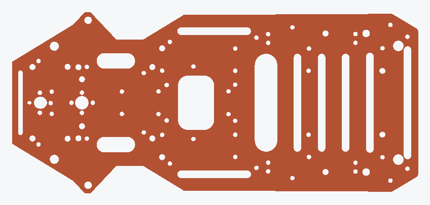
  &nbsp;&nbsp;
  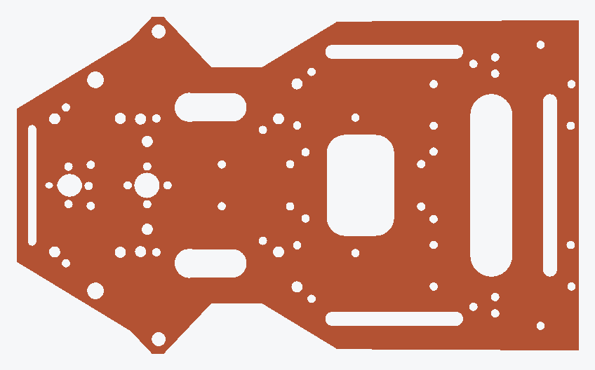

<i>Lower plate (left) and upper plate (right), rendered from the STL files in <code>models/</code>.</i>

The lower deck is an off-the-shelf metallic frame, originally sold for four-wheeled robot kits. We kept it because a metal base does not flex or crack under load, and a chassis that flexes quietly ruins steering geometry that you then spend a weekend trying to debug in software. Its one drawback is footprint — it is a large frame, which is exactly why the second level exists.

The upper deck is our own design, cut from acrylic. Moving the Raspberry Pi, the camera mount and the power distribution board upstairs is what let a 285 mm long vehicle fit inside the 300 × 200 × 300 mm starting envelope: we bought vertical space, which we had plenty of, to spend less horizontal space, which we did not.

The two decks are held apart by spacers, which gives us a wiring gap between the levels instead of a wiring problem. Both are drilled with far more holes and slots than we use, deliberately, because during the build the position of almost everything moved at least once.

### Assembly Instructions

Everything below bolts onto the two decks. Build the lower deck completely before you add the spacers, because once the upper deck is on you cannot reach the steering linkage.

**1. Print the parts.** All the STLs are in [`models/`](./models/): the drive motor holder, two drive shaft couplers, the three ultrasonic sensor mounts and the three-piece camera mount. Print the drive shafts in **PETG at 100% infill** — this matters, and the reason is under [3D Printed Parts](#3d-printed-parts).

**2. Mount the drive motor.** The drive motor holder goes at the **rear of the lower deck**. The BO DC gear motor is a **dual-shaft** motor — one body with an output shaft coming out of each side — and it clamps into the holder across the width of the car, so that a shaft points at each rear wheel.

**3. Fit the drive shafts.** A printed drive shaft coupler pushes onto each of the motor's two output shafts, matching the flats on the shaft. A length of carbon fibre rod, cut to size, slots into the other end of each coupler and carries the drive out to that rear wheel, held by a grub screw. Driving both rear wheels from one motor this way is what lets us avoid a differential entirely. This is the part that took the most attempts to get right — see [3D Printed Parts](#3d-printed-parts).

**4. Build the steering.** The Ackermann steering linkage and the MG669R steering servo go at the **front of the lower deck**. Centre the servo at 90° before you connect the linkage, otherwise the mechanical straight-ahead and the software straight-ahead will not be the same thing.

**5. Mount the lower-level electronics.** The ESP32 and the L298N motor driver sit on the lower deck, near the middle so the wiring to the front and rear is symmetric.

**6. Add the spacers and the upper deck.** The spacers set the gap between the two levels. Run the wiring up through that gap before the top deck goes on.

**7. Mount the Raspberry Pi and the batteries.** The Raspberry Pi 5 with its active cooler, the power distribution board and the Li-ion cell holders go on the upper deck.

**8. Mount the camera.** The three-piece camera mount bolts to the front of the upper deck. The camera board sandwiches between the main housing and the 3 mm backing plate, and the mounting arm sets the angle. Point the camera **slightly downwards** — it needs to see the base of the pillars on the mat, not the ceiling of the venue.

**9. Mount the ultrasonic sensors.** Three printed mounts, one at the front and one on each side, each holding an HC-SR04 flat against the direction it is measuring.

**10. Wire it up.** Follow [`schemes/`](./schemes/) and the [pin table](#esp32-pin-mapping) below, then run `Full_Bot_Sensor_and_Motor_Test.ino` before you trust anything.

### Drive Motor and Transmission

Rear wheel drive from a **single dual-shaft 100 RPM BO DC gear motor**, running off the 12 V rail and clamped into the printed holder at the back of the lower deck. A shaft comes out of each side of the motor body, so one motor drives both rear wheels through the printed couplers and carbon fibre rods. Power goes through the L298N driver, which takes the low-power direction signals from the ESP32 and switches the current the motor actually needs, in both directions.

We run it at about **0.4 m/s**. That is a deliberate ceiling rather than the motor's limit, and the reasoning — along with what happened when we tried a faster one — is under [100 RPM vs. a Faster Drive Motor](#100-rpm-vs-a-faster-drive-motor).

  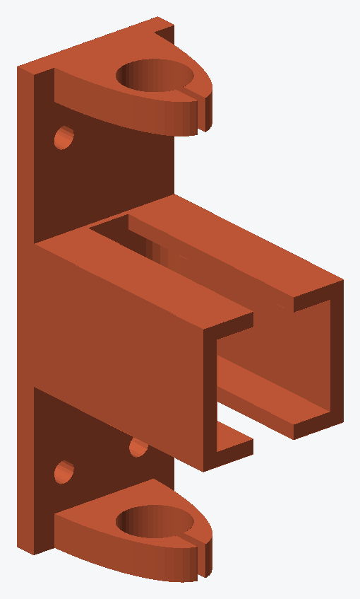

Steering and drive are completely separate systems on this car: the front wheels only steer and the rear wheels only drive. Neither has to compromise for the other, which means the steering geometry could be designed for cornering without worrying about transmitting torque, and the drivetrain could be designed for torque without worrying about turning.

### Steering Mechanism

The two front wheels are steered by a high torque MG669R servo through an **Ackermann steering linkage**. In software the servo runs between 30° (full left) and 150° (full right), with 90° as straight ahead.

  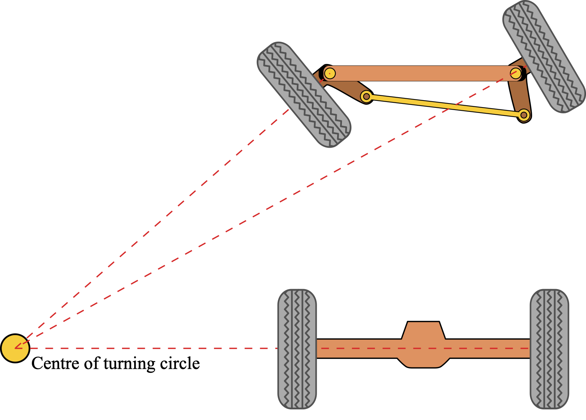

<i>Ackermann geometry: the inside wheel turns further than the outside wheel so that both roll around a common centre of turning circle. Diagram by Andy Dingley, after Bromskloss — <a href="https://commons.wikimedia.org/wiki/File:Ackermann_turning.svg">Wikimedia Commons</a>, <a href="https://creativecommons.org/licenses/by-sa/3.0/">CC BY-SA 3.0</a>.</i>

When a car turns, the inside wheel is following a tighter circle than the outside wheel. If both wheels are turned by the same angle, one of them has to scrub sideways across the ground. Ackermann geometry turns the inside wheel further than the outside wheel so that both roll cleanly around the same centre point. For us that meant sharper, more predictable turns and less fighting against our own tyres.

**Turning radius.** We found this by testing rather than by calculating it. We kept adjusting the steering limits and running the vehicle until we found the sharpest turn it could make without the wheels binding or the vehicle scrubbing across the mat.

**Control.** In the open round the ESP32 generates the PWM for both the servo and the motor directly. In the obstacle round the Raspberry Pi decides on a speed and a steering angle and sends them to the ESP32, which then generates the same PWM signals. The mechanical system does not change between rounds, only what is deciding the numbers.

### Wheels

We run **Funduino wheels** — a rubber tyre with a block tread on a plastic rim, the standard hobby robotics wheel of that size. They are on all four corners.

| Advantages | Disadvantages |
|:-----------|:--------------|
| More efficient at speed | Low precision |
| Less friction against the surface | Limited traction on smooth or dirty floors |
| More power and speed available to manoeuvre | Not durable enough for heavy-duty or industrial use |
| Excellent climbing ability | |
| Good at turning in tight spaces | |

The advantages are the ones we actually use: the game is won by getting round a corner quickly and cleanly, and a low-friction wheel that keeps its speed through a turn is worth more to us than a grippy wheel that fights the steering.

The disadvantage that bites is traction on a smooth floor. The WRO mat is smooth, and dust from a competition hall gets onto it, so a wheel that is fine on a workshop floor can slip on the mat. Slip matters more than it sounds: the whole corner strategy assumes the car follows the arc the steering geometry predicts, and a slipping wheel does not. Wiping the tyres before a run is genuinely part of our routine, not a superstition. Durability is not a concern for us — competition runs are minutes long, not hours — so we accepted that trade freely.

### 3D Printed Parts

Every mechanical part on this car was designed by us and printed. The full inventory with descriptions is in [`models/README.md`](./models/README.md).

**The drive shaft coupler was the hard one.**

  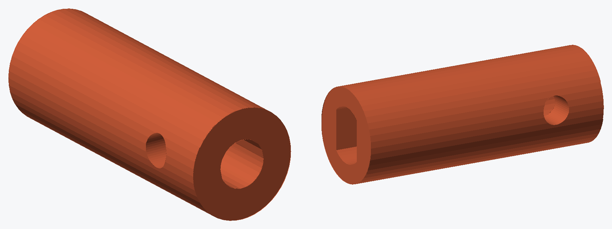

<i>The same part from both ends. Left: the round bore that takes the carbon fibre rod. Right: the double-D socket that fits the BO motor's output shaft. The cross hole takes the grub screw.</i>

It is a 10 mm diameter, 27 mm long sleeve, and there are two of them — one on each of the motor's output shafts. Every bit of drive torque in the vehicle passes through them. One end has a double-D socket that matches the flats on the motor shaft. The other end has a round bore that takes the sawn carbon fibre rod running out to the wheel, held by a grub screw through the wall.

**It took about 20 prints across 5 different designs.** The reason is that both ends are interference fits into parts we did not manufacture, so the tolerances had to be exact and there was no adjusting them afterwards:

- **Too tight** and the sleeve splits when you press the rod in, because a printed part is weakest along the layer lines and that is exactly the direction the wall gets pushed.
- **Too loose** and it holds fine by hand and then slips the moment the motor puts real torque through it, which is a failure that only shows up when the car is driving.
- The printed hole is never the diameter you asked for. Shrinkage and elephant's foot meant our first designs measured correct in the CAD and were wrong on the print bed, so the final dimensions came from measuring printed test pieces rather than from the datasheet.
- The double-D socket has to be clocked correctly as well. A round hole only has to be the right size; a D-shaped one has to be the right size **and** the right orientation, or the flats do not engage and the whole thing spins freely on the shaft.

The five designs went from a plain sleeve, through versions with thicker walls and a grub screw, to the final one with the pin hole and wall thickness chosen so it survives the press fit. This is by far the most reprinted part on the car, and it is also the part we would design first if we started again.

---

## Power and Sense Management

  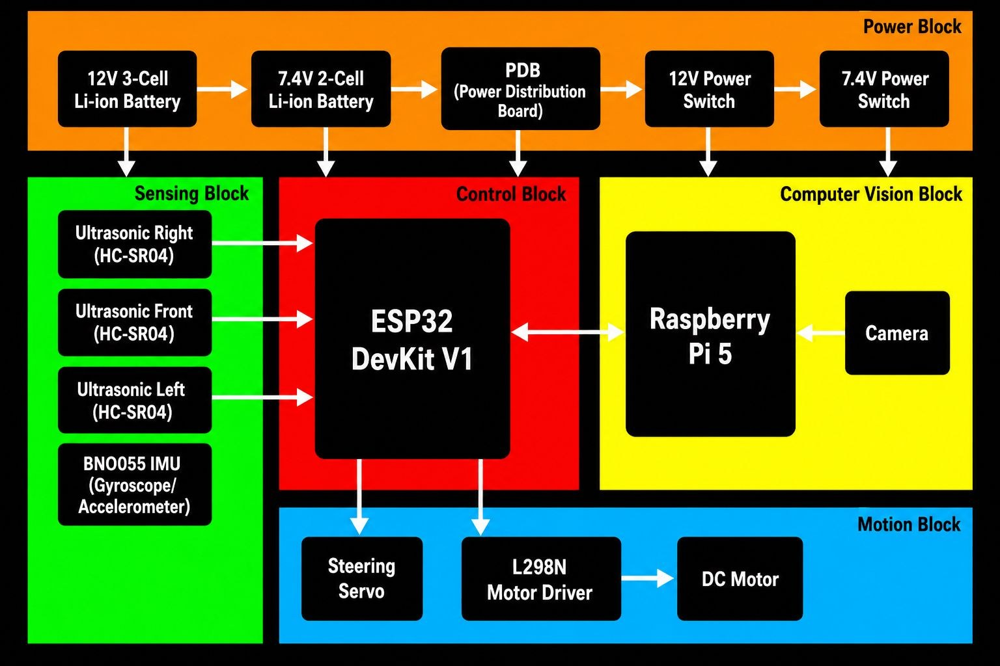

<i>The five blocks of the vehicle: power, sensing, control, computer vision and motion.</i>

### Power Supply

There are **two battery packs** on this car, and each one has its own switch.

**The main pack** is three 18650 Li-ion cells in series, about 11.1 V nominal and around 12.6 V fully charged. It feeds a power distribution board, which splits the supply into a regulated 5 V branch and a branch carrying the raw pack voltage. The 5 V branch runs the ESP32, the three ultrasonic sensors and — in the obstacle round — the Raspberry Pi. The raw pack voltage goes to the L298N, which is the only part that wants the higher voltage.

**The servo pack** is two cells in series, 7.4 V, and it powers the steering servo and nothing else. This is deliberate. A servo under load pulls a sharp current spike at exactly the moment the car is turning, and if it shared the logic rail that dip would land on the controller that is doing the steering. Giving it its own pack means the worst it can do is brown out itself.

**Power budget.** Both packs are 2200 mAh, and both are heavily oversized for a three minute round — deliberately, because a battery that is nearly flat behaves differently from a battery that is half full, and we did not want the last lap of a run to be driven by a different car than the first.

| | Main pack (3S, 11.1 V) | Servo pack (2S, 7.4 V) |
|:--|:--|:--|
| Continuous current | 1.25 A | 0.5 A |
| Continuous power | 13.88 W | 3.7 W |
| Peak current | 3.85 A | 2.5 A |
| Peak power | 42.74 W | 18.5 W |
| Theoretical runtime | 105 min | 264 min |
| Safe runtime, 80% of capacity | **84 min** | **211 min** |
| Competition round | 3 min | 3 min |

One thing worth knowing if you rebuild this: the Raspberry Pi 5 is fussy about its 5 V supply. If the current available drops it will reboot in the middle of a run, which is very hard to diagnose if you assume it is a software problem.

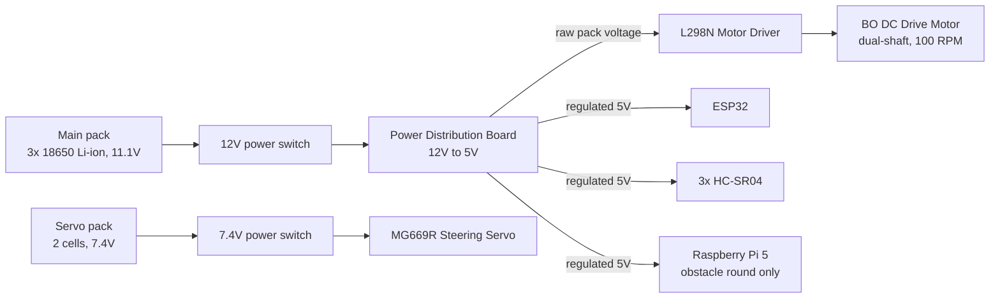
```mermaid
flowchart LR
    BAT[Main pack<br/>3x 18650 Li-ion, 11.1V] --> SW3[12V power switch]
    SW3 --> PDB[Power Distribution Board<br/>12V to 5V]

    PDB -->|raw pack voltage| L298[L298N Motor Driver]
    L298 --> MOT[BO DC Drive Motor<br/>dual-shaft, 100 RPM]

    PDB -->|regulated 5V| ESP[ESP32]
    PDB -->|regulated 5V| SENS[3x HC-SR04]
    PDB -->|regulated 5V| PI[Raspberry Pi 5<br/>obstacle round only]

    SBAT[Servo pack<br/>2 cells, 7.4V] --> SW2[7.4V power switch]
    SW2 --> SRV[MG669R Steering Servo]
```

### Switches and Starting a Run

Nothing on this car is started by plugging in a battery. Power and go are two separate actions, done by two different kinds of switch.

**The rocker switches turn the vehicle on.** Each battery pack has its own SPST switch — `SW3` on the 12 V main pack and `SW2` on the 7.4 V servo pack — so each is a true master switch for everything downstream of it. Splitting them also means the steering can be killed on its own, which is genuinely useful on the bench: you can power the logic and read every sensor with no chance of the servo suddenly moving under your hands. They are mounted where they can be reached without lifting the car, because the one thing you always need in a hurry is the off switch.

**The push button starts the run.** `SW1` is a momentary button wired to the ESP32 with an internal pull-up, pulling the pin to ground when pressed. Powering the car on does nothing except boot it: the code initialises, centres the servo, starts the IMU, zeroes the heading, and then sits and waits. Nothing moves until the button is pressed.

Splitting these two jobs matters. It means the car can be switched on, placed on the mat, checked, and lined up while it is fully powered and completely still. If power-on also meant go, every one of those steps would be a race.

What the button does depends on the round:

| Round | What pressing the button does |
|:------|:------------------------------|
| **Open** | Starts the ESP32's wall following routine directly. The ESP32 is the only controller, so the button press is the whole start sequence. |
| **Obstacle** | The ESP32 sends the start signal up to the Raspberry Pi over the serial link. The Pi has already been running and waiting, so the button is what releases it to begin the run. |

### Controllers

| Controller | Role |
|:-----------|:-----|
| **ESP32 Dev Board** | Real-time hardware control. Reads the three ultrasonics and the IMU, generates the servo and motor PWM. In the open round it also makes every decision; in the obstacle round it makes none. |
| **Raspberry Pi 5 (8GB)** | Obstacle round only. Runs the camera and the vision code, and makes every driving decision. |

### ESP32 Pin Mapping

  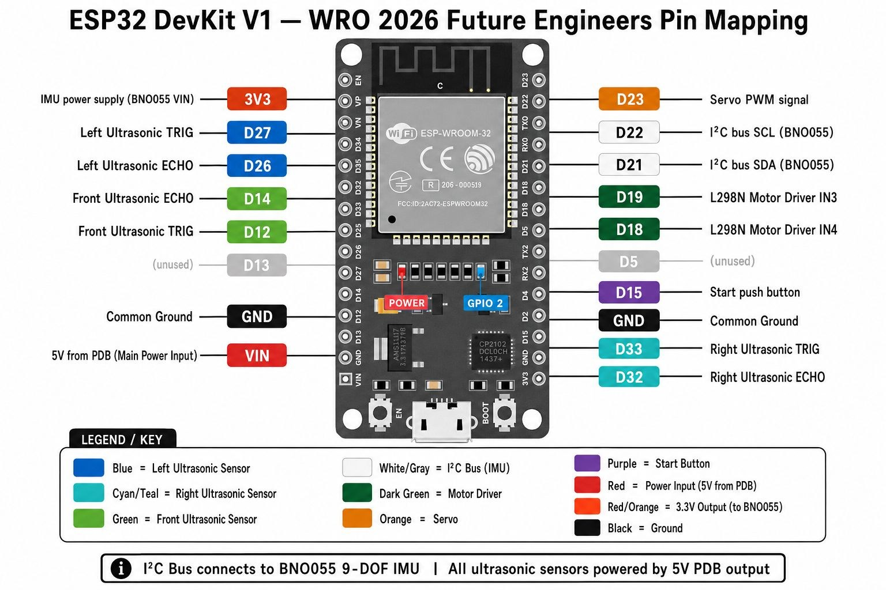

The table below is taken directly from the firmware in [`src/`](./src/) and is the authoritative wiring reference.

| ESP32 pin | Connected to |
|:----------|:-------------|
| `D27` / `D26` | Left ultrasonic — TRIG / ECHO |
| `D12` / `D14` | Front ultrasonic — TRIG / ECHO |
| `D33` / `D32` | Right ultrasonic — TRIG / ECHO |
| `D21` / `D22` | I²C to the BNO055 IMU — SDA / SCL |
| `D23` | Steering servo PWM |
| `D18` | L298N direction input 1 (forward) |
| `D19` | L298N direction input 2 (reverse) |
| `D5` | Start push button, `INPUT_PULLUP` to GND |
| `3V3` | BNO055 supply |
| `VIN` | 5 V in from the power distribution board |
| `GND` | Common ground for every subsystem |

### Sensors

**Ultrasonic sensors (×3).** Mounted at the front and on both sides. They measure how far away the walls are, which is what the vehicle uses to stay centred in the lane and to recognise that it has arrived at a corner.

**BNO055 IMU.** A 9-axis absolute orientation sensor, which gives us a real heading rather than a raw gyro rate. Small steering errors and wheel slip would otherwise build up over three laps until the vehicle is driving at an angle, so the heading from the IMU is used to correct that drift continuously and to confirm that each 90 degree turn has actually finished.

Where it sits took a round of debugging. We first mounted it on top of the steering servo, which is a convenient flat surface and a terrible idea: the metal in the servo interferes with a magnetometer, and a 9-axis sensor that is quietly being lied to by its own compass produces a heading that looks plausible and is wrong. It now lives towards the back of the vehicle, away from the servo and the motor.

Every sensor except the camera is wired to the ESP32, in both rounds. What changes between rounds is who reads the ESP32.

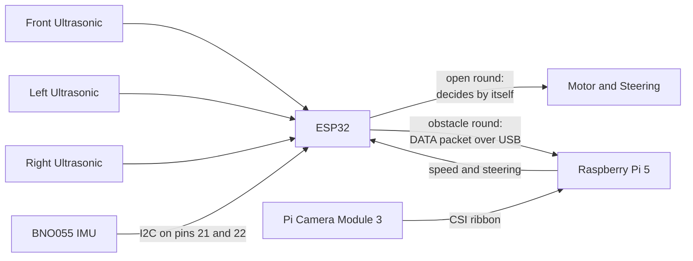
```mermaid
flowchart LR
    UF[Front Ultrasonic] --> ESP[ESP32]
    UL[Left Ultrasonic] --> ESP
    UR[Right Ultrasonic] --> ESP
    IMU[BNO055 IMU] -->|I2C on pins 21 and 22| ESP

    ESP -->|open round:<br/>decides by itself| ACT[Motor and Steering]

    CAM[Pi Camera Module 3] -->|CSI ribbon| PI[Raspberry Pi 5]
    ESP -->|obstacle round:<br/>DATA packet over USB| PI
    PI -->|speed and steering| ESP
```

### Camera

A Raspberry Pi Camera Module 3 (Wide) on the CSI ribbon connector, mounted at the front of the upper plate on a three-piece printed mount and angled downwards. This is what the vehicle uses to find the red and green traffic sign pillars and the magenta parking limiters, none of which an ultrasonic sensor can tell apart.

Two things about the mounting matter. The **wide lens** lets the car see pillars that are off to the side, which buys it more time to work out how to get around them. The **downward angle** keeps the mat and the base of the pillars in frame instead of the venue's ceiling and lights, which is what keeps the colour thresholds usable in a hall we have never practised in.

### Schematics

One schematic per round, in [`schemes/`](./schemes/), drawn in KiCad 10.0.4. Both are in the repository as a PNG for viewing here and as a PDF for printing or zooming in on a detail.

**Open Round** — everything hangs off the ESP32, because it is the only controller in this round.

  <a href="./schemes/open_round/schematic.pdf">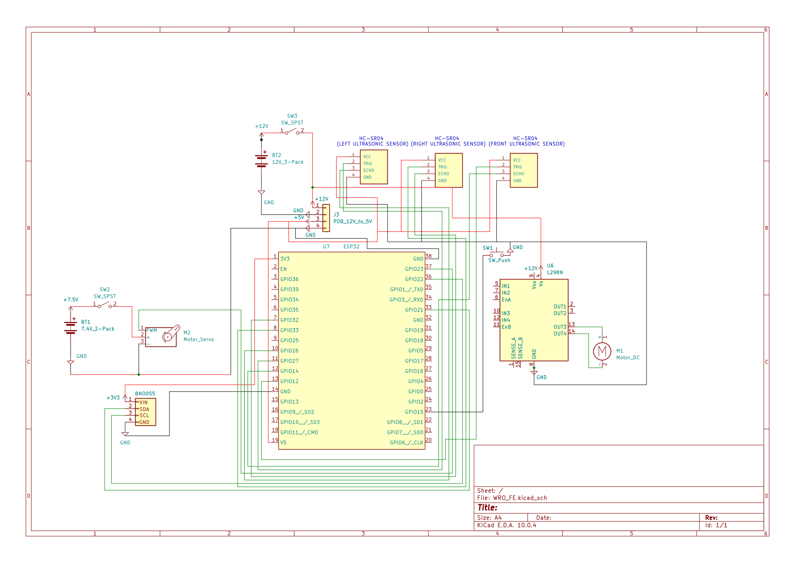</a>

**Obstacle Round** — the same circuit with the Raspberry Pi added. The Pi takes its 5V from the same distribution board and talks to the ESP32 over serial. The camera is not on the sheet because it is a CSI ribbon connection rather than GPIO wiring.

  <a href="./schemes/obstacle_round/schematic.pdf">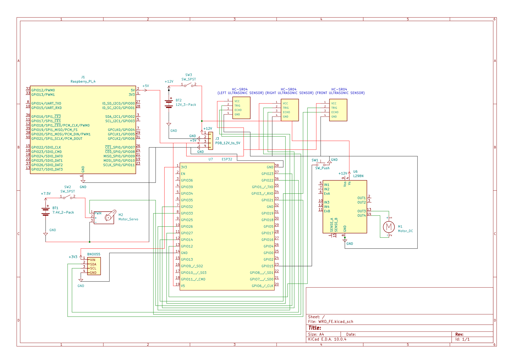</a>

<i>Click either schematic for the full-resolution PDF.</i>

### Components List

Before building anything, we decided on our hardware requirements and our bill of materials. Every component on this list is there to do a specific job, and each choice had a reason behind it rather than being whatever we had lying around.

#### Open Challenge Round

| Component | What it does |
|:----------|:-------------|
| **ESP32 Dev Board** | The only controller in this round. It does all of the processing and drives every sensor, the servo and the motor. |
| **BO DC Gear Motor** | Dual-shaft, 100 RPM, 12V. Drives both rear wheels through the printed couplers and carbon fibre rods, controlled through the L298N driver. |
| **Carbon Fibre Rods (×2)** | Rear axles, one per wheel, running from the printed couplers out to the rear wheels. |
| **MG669R Steering Servo** | Front wheel steering. A high torque servo is worth using here, because the steering has to hold its angle while the vehicle is moving. |
| **Ultrasonic Sensors (×3)** | Mounted at the front, the left and the right to measure the distance to the walls on each side. |
| **BNO055 IMU** | A 9-axis absolute orientation sensor. It gives us a real heading rather than a raw gyro rate, so the vehicle can hold a straight line and know when it has actually completed a 90 degree turn. |
| **L298N Motor Driver** | Takes the low power signals from the ESP32 and switches the current the drive motor needs, in both directions. |
| **Power Distribution Board** | Splits the battery power into separate branches, so the electronics get a regulated 5V supply and the motor gets the raw pack voltage. |
| **Li-ion Cells (×3)** | The main pack. Three 18650 cells in series power the whole vehicle, at about 11.1V nominal. |
| **Li-ion Cells (×2)** | The servo pack. Two cells in series, 7.4V, powering the steering servo and nothing else. |
| **SPST Switches (×2)** | One master power switch per battery pack. |
| **Push Button** | Start button, read by the ESP32. |
| **Funduino Wheels (×4)** | Rubber tyre on a plastic rim. |

#### Obstacle Challenge Round

Everything from the open round, plus:

| Component | What it does |
|:----------|:-------------|
| **Raspberry Pi 5 (8GB)** | The brain and the master controller. It runs the vision system and makes every driving decision. |
| **Raspberry Pi 5 Active Cooler** | Keeps the Pi from overheating. Running the camera and OpenCV together pushes the processor hard, and a hot Pi throttles itself and slows the whole loop down. |
| **Raspberry Pi Camera Module 3 (Wide)** | The vision input, mounted at the front on a 3D printed mount. The wide lens matters because it lets the vehicle see traffic signs that are off to the side. |

In this round the ESP32 becomes the slave controller: it only reads the sensors and drives the motor and servo, taking its orders from the Pi.

---

## Competition Constraints

The rules set hard limits, and it is worth writing down how close we actually are to each one, because "it fits" and "it fits with 15 mm to spare" are different engineering positions.

| Constraint | Rule limit | Our vehicle | Margin |
|:-----------|:-----------|:------------|:-------|
| Length | 300 mm | 285 mm | 15 mm |
| Width | 200 mm | 185 mm | 15 mm |
| Height | 300 mm | 165 mm | 135 mm |
| Weight | 1500 g | 1180 g | 320 g |
| Steering | Must be front-wheel Ackermann | Single 15 kg servo, dual-arm linkage | Compliant |
| Drive | Must be rear-wheel; differential and omnidirectional drive forbidden | One dual-shaft motor driving both rear wheels through carbon fibre rods | Compliant, no differential |

The two tight numbers are length and width, and they are why the vehicle has two decks at all. The base is a large off-the-shelf metal frame, and laying every component out on one level would have pushed us past 200 mm wide. Moving the Raspberry Pi, the camera mount and the distribution board onto a second deck spends height, where we have 135 mm to give away, to buy back width, where we have 15 mm.

Avoiding a differential is a rules constraint that turned into a mechanical one: a single dual-shaft motor with a rigid rod to each rear wheel is the simplest legal way to drive both wheels, and it is why the [drive shaft coupler](#3d-printed-parts) matters as much as it does.

---

## Engineering Trade-offs

Every one of these is a choice where the option we did not take was a genuinely reasonable option. This section is what we gave up, not just what we gained.

### Ackermann Steering vs. Differential Steering

We could have skipped steering entirely and turned the car by driving the left and right wheels at different speeds, which is what most first robots do. We chose a steered front axle with Ackermann geometry instead.

| What we gained | What it cost us |
|:---------------|:----------------|
| **Faster corners.** Both front wheels roll around a common centre instead of one of them scrubbing sideways, so the car carries speed through a turn instead of scrubbing it off. | **It cannot turn on the spot.** There is a minimum turning radius set by the geometry, and no amount of code changes it. This is exactly why the corner routine reverses first to make room, and why a recovery from a bad angle takes a reverse manoeuvre instead of a spin. |
| **Less load on the drivetrain.** Energy that would go into dragging a tyre sideways goes into moving the car forward instead. | **Backlash.** Every printed pivot in the linkage has a little play in it, and it all adds up into a steering deadband around centre where small servo movements do nothing. |
| **Less load on the servo.** The servo moves a linkage rather than fighting a tyre that is being dragged across the mat, so it stalls less and draws less current. | **The geometry has to be right.** The steering arms have to point towards the centre of the rear axle. Get the angle wrong and you have all the mechanical complexity of Ackermann with the tyre scrub of parallel steering. |
| **Repeatability.** A given servo angle produces the same arc every time, which is what makes an IMU-timed 90° turn land in the same place lap after lap. | **More things to break.** A differential-steer car has two motors and no linkage. Ours has a linkage with pivots, and a pivot that loosens mid-competition is a real risk. |

### Funduino Wheels

Covered in full under [Wheels](#wheels) above. The short version: we traded grip for speed and low rolling resistance, which suits a smooth mat and a course won on corner speed, and we accept that a dusty mat costs us traction and that these wheels would not survive long-term heavy use.

### Ultrasonic Sensor Placement

  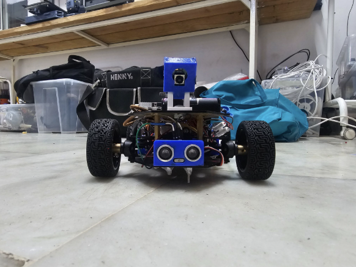
  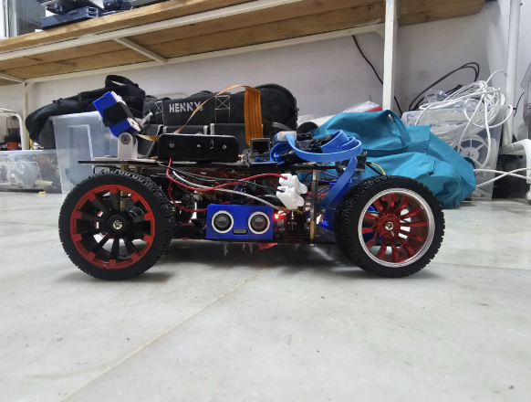
  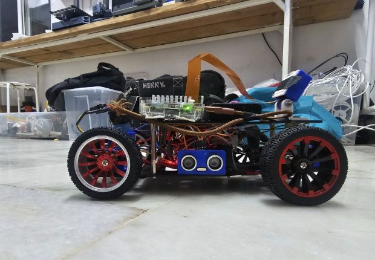

<i>Front and both sides. The ultrasonic sensors sit low and square-on to the wall they measure; the camera sits high at the front, angled down.</i>

**Three sensors, front, left and right, each mounted flat against the direction it measures.**

*Why square-on.* An ultrasonic sensor works by listening for its own echo. A sensor aimed straight at a wall gets a strong, early echo. The same sensor tilted a few degrees gets a weak one, or one that bounces away entirely and never comes back, and a missed echo reads as "the wall is very far away" — which is the single most dangerous wrong answer a wall-following car can be given. So every mount holds its sensor perpendicular to its wall, and the mounts are printed rather than taped for exactly that reason.

*Why the sides are mounted at the middle of the car, not at the nose.* This one we got wrong before we got it right. A side sensor mounted at the front swings sideways when the car steers, so its reading changes when the car turns even if the car has not moved any closer to the wall. Mounted near the middle of the wheelbase, the sensor barely moves when the wheels turn, so distance means distance.

*What it costs us.* A mid-mounted side sensor sees a corner opening up **later** than a nose-mounted one would, because it is physically further back. We compensate in software: the front sensor calls the corner at 65 cm, and the turn routine reverses briefly first to buy back the room the later detection cost us.

*Why only three.* Ultrasonic sensors interfere with each other — one sensor's ping can be heard as another's echo — and each measurement costs real time in the control loop, because you have to wait for the sound to come back. Three sensors is the minimum that answers the two questions the open round asks: *am I centred?* and *has the wall in front arrived?*

*What they cannot do.* The HC-SR04 has a wide beam and no idea what it is looking at, so in the obstacle round it will happily report a traffic-sign pillar as a wall. This is precisely why pillar decisions come from the camera and the ultrasonics are only ever trusted about walls.

### 100 RPM vs. a Faster Drive Motor

We started on a 60 RPM motor, found it too slow for competitive lap times, and went up — but not as far as we could have.

**The argument for stopping at 100 RPM is that speed is bounded by how fast the car can see, not by how fast it can move.** At 30 frames per second, a vehicle doing 1.2 m/s (a 300 RPM motor) travels 3 cm between frames, so a pillar first detected at 30 cm gives the vision pipeline about **7 frames — roughly 250 ms** — to detect it, classify it, decide a side and start steering. That was not enough, and it showed up as pillar collisions.

At 100 RPM the car does about **0.4 m/s**, or 1.33 cm per frame, which turns the same 30 cm of warning into **more than 22 frames, about 750 ms**. Obstacle avoidance success went from **40% to 86% across 50 test laps**.

| | 60 RPM | 100 RPM (final) | 300 RPM |
|:--|:--|:--|:--|
| Speed | too slow to be competitive | ~0.4 m/s | 1.2 m/s |
| Distance per frame at 30 FPS | — | 1.33 cm | 3 cm |
| Frames to react to a pillar at 30 cm | — | 22+ | ~7 |
| Obstacle avoidance success | — | **86%** | 40% |

The cost is straightforward: our lap times are slower than they could be. We took that deliberately, and it is a cheap thing to change later — a higher RPM motor is a drop-in replacement, so speed is available to us as soon as the perception side can keep up with it.

### PLA vs. PETG for the Drive Shafts

Our first drive shaft couplers were printed in PLA, because that is what everyone prints in. They lasted **8 to 12 hard acceleration cycles** before cracking along the layer lines.

That failure mode is not really about strength, it is about ductility. PLA is rigid, and a rigid part under repeated torsional shock does not stretch and recover — it splits where the layers bond, which is the weakest direction in any printed part and unfortunately the exact direction the torque loads it.

Reprinting in **PETG at 100% infill** took the same part past **100 cycles without failure**. Same geometry, same printer, different filament: the only change was picking a material that gives a little instead of cracking.

| | PLA | PETG, 100% infill |
|:--|:--|:--|
| Cycles before failure | 8–12 | 100+ |
| Failure mode | Split along layer lines | None observed |

The costs are real but small: PETG is slower to print, stringier, and needs a hotter nozzle. For a part that carries every newton-metre the car produces, that is not a difficult trade.

### Li-ion Cells vs. a LiPo Pack

The full reasoning is in [`docs/Decisions.md`](./docs/Decisions.md). In short:

| What we gained | What it cost us |
|:---------------|:----------------|
| **Packaging.** Three 18650 cells in a holder bolt flat to the plate and use space we already had, rather than a brick that has to be found a home. | **Peak current.** A LiPo can deliver current faster. For a car running one drive channel this rarely matters, but it is a real advantage we gave up. |
| **Serviceability.** One bad cell can be swapped for one new cell instead of replacing the whole pack. | **Not a weight saving.** We did not choose these to save weight, and with the holder they are not obviously lighter than an equivalent LiPo. |
| **Easier to live with.** They are simpler to charge and safer to store between build sessions — a LiPo is not something we wanted sitting in a school bag between meetings. | **More connections.** A holder with individual cells has more contact points than a single pack, and contacts are where intermittent faults hide. |
| **Tidier electronics.** With a fixed cell holder and a distribution board, the wiring has a fixed layout instead of being rearranged every time the battery is swapped. | |

### One Battery Domain vs. Two

This one we got wrong first and fixed with data.

**Version 1 ran everything from a single 3S pack through buck converters.** On the bench it looked fine. Under load it crashed — and specifically it crashed *while steering*, which is the worst possible moment. The steering servo pulls a sharp transient when it swings under load, that transient dragged the shared rail down, and the Raspberry Pi 5 brown-out threshold is **4.75 V**, which does not leave much room below a nominal 5 V.

**Version 2 splits the electrical system into two isolated domains:** a 3S 11.1 V 2200 mAh pack for the controllers, sensors and drive motor, and a separate 2S 7.4 V 2200 mAh pack for the steering servo alone.

| | Single domain (V1) | Dual domain (V2) |
|:--|:--|:--|
| Logic rail under steering load | Sagging, brownouts | Stable at **5.02 V** |
| Crashes across 100+ stress cycles | Repeated | **0** |

What it costs: a second pack to charge, a second switch to remember, and about 100 g of vehicle weight. Against a failure that ends a run, that is not a close call.

### Vision Only vs. Vision Plus Ultrasonics and IMU

The obvious way to build this car is to do everything with the camera, since the camera is the only sensor that can tell a red pillar from a green one. We tried that, and it fails on walls rather than on pillars.

**A purely vision-based edge-tracking approach misread the wall boundary in 32% of recorded frames** under varying light, because glare and floor reflections look exactly like an edge to a threshold. Nearly a third of frames giving a wrong answer about where the wall is makes wall following unusable.

Adding **three HC-SR04 ultrasonics and the BNO055 IMU** fixed it, because those sensors do not care about light at all. Ultrasound measures distance by timing an echo, and the IMU measures orientation, so neither has any opinion about glare. Alignment accuracy went to **100% across lighting from 200 lux to 800 lux**.

So the division of labour is not arbitrary: **the camera answers questions about colour and identity, the ultrasonics and IMU answer questions about geometry**, and neither is asked to do the other's job. The cost is three more sensors, more wiring, and a fusion problem to solve in software.

### 1080p vs. 640x480 Vision Pipeline

At 30 frames per second the pipeline has **33.33 ms** to finish with a frame before the next one arrives. Miss that and you are not merely slow, you are dropping frames and making decisions on stale pictures.

| Resolution | Processing time per frame | Fits in the 33.33 ms budget? |
|:--|:--|:--|
| Full HD | 58 ms | No — dropped frames, lag, thermal throttling |
| **640 × 480** | **12 ms** | Yes, with 21 ms to spare |

Downscaling to 640 × 480 cut processing to about a third of the frame budget and stopped the Pi from thermally throttling itself. What we gave up is resolution on distant pillars — but a pillar too small to resolve at 640 × 480 is also too far away to be worth steering for yet, so in practice the resolution we lost was resolution we were not using.

### Two Controllers vs. One

Running the whole obstacle round on the Raspberry Pi alone would have been simpler to write, and Version 1 of this vehicle did exactly that on a Raspberry Pi 3B+. We split it because the two jobs have incompatible timing requirements: reading an ultrasonic echo and holding a servo pulse need microsecond consistency, and a general purpose operating system running a camera and OpenCV cannot promise that.

The failure is measurable rather than theoretical. **With vision and control on one processor, heavy vision load (85–95% CPU) dragged the low-level control loop from its target 100 Hz down to an inconsistent 45 Hz** — and an inconsistent loop rate is worse than a slow one, because the steering correction assumes it is being applied at a known interval. What it looked like from the outside was delayed steering and overshooting the wall.

| | Single Pi (V1) | Pi 5 + ESP32 (V2) |
|:--|:--|:--|
| Control loop rate | 45 Hz, inconsistent | **100 Hz, deterministic** |
| Behaviour under vision load | Delayed steering, wall overshoot | Unaffected |

Splitting the work means the ESP32's loop rate does not depend on what the Pi is doing, because the Pi is not doing anything on the ESP32's processor. The ESP32 does the parts that must happen on time, the Pi does the parts that must happen intelligently.

The cost is that we now have a link between them that can fail, which is why both sides have a timeout (see [Failure Handling](#failure-handling)).

---

## Software

The two rounds do not share a program, because they do not share a problem. The open round is about staying centred between walls that never move, and one microcontroller is enough for that. The obstacle round adds coloured pillars that have to be passed on a specific side, which needs a camera, and a camera needs a computer. So the software is split into two codebases that happen to drive the same chassis.

### Software Building Blocks

  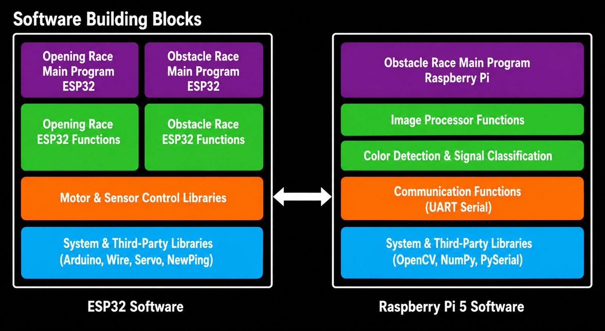

Each side is layered the same way: system and third-party libraries at the bottom, our own reusable functions above them, and the round's main program on top. The only thing crossing between the two stacks is the serial link.

### Development Environment

| Part | Language | Written and flashed with |
|:-----|:---------|:-------------------------|
| ESP32 (both rounds) | C++ / Arduino | Arduino IDE 2.0 or newer, with the ESP32 board package by Espressif Systems |
| Raspberry Pi (obstacle round) | Python 3 | Any editor, run from the terminal on Raspberry Pi OS 64-bit |

The ESP32 is programmed as an **ESP32 Dev Module** at 115200 baud, which is also the baud rate the two controllers talk to each other on.

### Programming Languages

- **Python** — the Raspberry Pi vision and navigation program, and the HSV tuning tool.
- **C++ (ESP32)** — both ESP32 sketches, written and flashed with the Arduino IDE.

### Libraries and Dependencies

**On the ESP32:**

| Library | Why it is needed |
|:--------|:-----------------|
| `ESP32Servo` | Generates the servo PWM. The standard Arduino `Servo` library does not work on the ESP32. |
| `Adafruit BNO055` | Talks to the IMU and gives us Euler angles instead of raw sensor values. |
| `Adafruit Unified Sensor` | Required by the BNO055 library. |
| `Wire` | I2C, already included with the Arduino IDE. |

**On the Raspberry Pi:**

| Library | Why it is needed |
|:--------|:-----------------|
| `picamera2` | Captures frames from the Camera Module 3. Pre-installed on Raspberry Pi OS. |
| `opencv-python` | Colour conversion, thresholding, contour finding and the debug preview window. |
| `numpy` | The HSV bounds and all the array work OpenCV depends on. |
| `pyserial` | The USB serial link down to the ESP32. |

### Open Round: How the Code Works

Everything runs on the ESP32 in a single loop, and the whole strategy is built on one idea: the walls tell you where you are, and the IMU tells you which way you are facing.

On boot the code centres the servo, starts I2C, puts the BNO055 into NDOF mode and zeroes the heading, then waits on the start button. It also records the front distance at the moment it starts, which is what it later uses to recognise the starting position again.

In the main loop it reads the heading and all three distances, and then decides between four cases:

- **Too close to a wall in front** (under 22 cm) — reverse until there is at least 40 cm of room again, with a 1.5 second cap so it can never get stuck reversing.
- **A corner is coming up** (front under 65 cm, one side open past 85 cm and the other side closed) — reverse briefly to make room, then run the turn routine for whichever side is open.
- **Otherwise** — drive forward and hold the target heading, steering by the difference between the current yaw and the heading it is supposed to be on.

Lap counting works by counting turns rather than by timing. The first lap is used to learn how many turns a lap actually takes, and after that the count is used to track laps. Once three laps are done the vehicle switches into a return-to-start mode, drives until the front distance matches the distance it recorded at the beginning, creeps forward for another moment and stops.

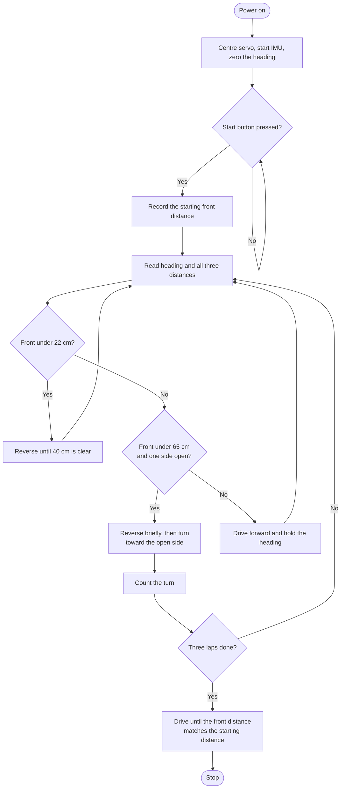
```mermaid
flowchart TD
    A([Power on]) --> B[Centre servo, start IMU, zero the heading]
    B --> C{Start button pressed?}
    C -->|No| C
    C -->|Yes| D[Record the starting front distance]
    D --> E[Read heading and all three distances]

    E --> F{Front under 22 cm?}
    F -->|Yes| G[Reverse until 40 cm is clear]
    G --> E

    F -->|No| H{Front under 65 cm<br/>and one side open?}
    H -->|Yes| I[Reverse briefly, then turn<br/>toward the open side]
    I --> J[Count the turn]
    J --> K{Three laps done?}
    K -->|No| E
    K -->|Yes| L[Drive until the front distance<br/>matches the starting distance]
    L --> M([Stop])

    H -->|No| N[Drive forward and hold the heading]
    N --> E
```

### Obstacle Round: How the Code Works

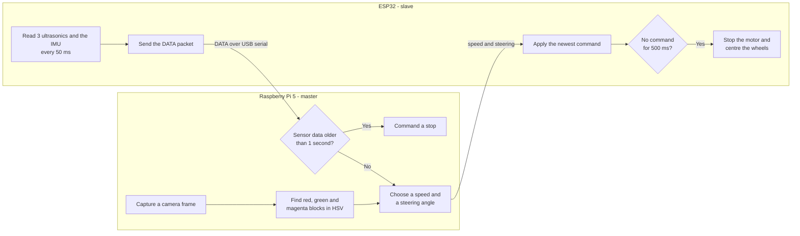
```mermaid
flowchart LR
    subgraph PI[Raspberry Pi 5 - master]
        direction TB
        P1[Capture a camera frame] --> P2[Find red, green and<br/>magenta blocks in HSV]
        P2 --> P3[Choose a speed and<br/>a steering angle]
        P4{Sensor data older<br/>than 1 second?} -->|Yes| P5[Command a stop]
    end

    subgraph ESP[ESP32 - slave]
        direction TB
        E1[Read 3 ultrasonics and the IMU<br/>every 50 ms] --> E2[Send the DATA packet]
        E3[Apply the newest command] --> E4{No command<br/>for 500 ms?}
        E4 -->|Yes| E5[Stop the motor and<br/>centre the wheels]
    end

    E2 -->|DATA over USB serial| P4
    P4 -->|No| P3
    P3 -->|speed and steering| E3
```

**Division of labour.** The ESP32 stops making decisions entirely. It reads the three ultrasonic sensors and the BNO055 every 50 ms, pushes them up to the Pi, and applies whatever speed and steering angle comes back. The Pi runs the camera, finds the pillars, and decides everything. Neither side does the other's job: the Pi never touches a sensor pin, and the ESP32 never sees a camera frame.

**The link between them.** Commands going down are one line of text, `speed,steering`, where speed is -255 to 255 and steering is 30 to 150 with 90 being straight. Data coming up is a `DATA` line with the three distances, the heading and the four BNO055 calibration values. The Pi handles serial on a background thread so that waiting for the port never stalls the camera loop, and it rate limits commands to 20 per second so the ESP32's input buffer cannot fill up faster than it drains.

**Seeing the pillars.** Each frame is converted to HSV, because HSV separates "what colour is this" from "how brightly lit is it" far better than RGB does, which matters when the venue lighting is not the lighting we practised in. Separate thresholds pull out red pillars, green pillars and the magenta parking limiters. Contours smaller than our minimum area are thrown away so that specks of noise are not treated as pillars.

  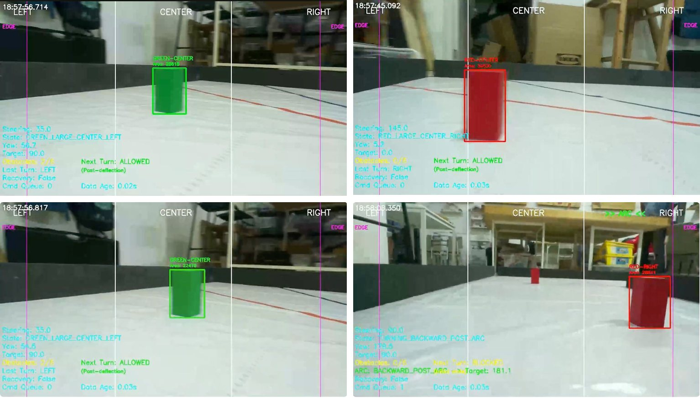

<i>The live annotated feed from a test run. Each frame shows the detected pillar and its bounding box, the contour area used as a distance estimate, the LEFT / CENTER / RIGHT zones and the EDGE lines, and the state the navigation code is in — steering angle, current yaw against target heading, obstacle count, last turn direction and whether the next corner turn is allowed or blocked.</i>

That overlay is not decoration. It is recorded for every run, and it is how we work out afterwards what the car was thinking, instead of guessing from the outside. `Data Age: 0.03s` in the corner is the staleness check from [Failure Handling](#failure-handling) reporting that the sensor data behind that decision was 30 ms old.

**Deciding where to go.** The WRO rule is that red pillars are passed on the right and green on the left, so colour decides the direction. Distance decides the urgency: a pillar's apparent area tells us roughly how close it is, and the steering angle is scaled from about 10 degrees for a distant pillar up to 60 degrees for one that is nearly on top of us. Where the pillar sits in the frame adjusts that slightly, with a pillar dead ahead getting a firmer push than one already drifting off to the correct side. A pillar right at the edge of the frame is ignored, because the vehicle is already going to miss it and steering again would only throw the line away.

With no pillars in sight the vehicle goes back to holding its heading off the IMU, exactly like the open round does.

**Corners.** A corner turn is only allowed when the frame is completely clear of pillars, the front sensor is inside 60 cm, and one side is open while the other is closed. There is one more rule that took us a while to arrive at: the vehicle has to have gone around at least one pillar since its last turn. Without that, it would sometimes take two turns in the same corner and lose the lap count. The turn itself comes in two shapes chosen by how much room is on the far side — a forward-then-reverse manoeuvre when there is space, and a single forward arc when there is not. Either way the IMU decides when the turn is finished, and afterwards the heading is snapped to the nearest 90 degrees so that a degree of error per corner does not become twelve degrees by the end of the run.

**Parking.** The vehicle starts inside the parking lot, so the run opens with a short scripted exit: turn away from the wall, counter-steer, straighten, and begin the laps. After twelve counted turns it goes looking for the magenta limiters, and only commits to parking once it has seen one convincingly across several frames rather than in a single lucky one. It then drives past the first limiter, reverses into the bay in two steering stages, and finally checks its own work by confirming its heading and its distance from the wall before declaring itself parked.

### Failure Handling

Most of what went wrong during testing was not the vehicle making a bad decision, it was the vehicle making a decision on information that was no longer true. Three things guard against that:

- **The ESP32 watchdog.** If no command arrives for 500 ms, the ESP32 stops the motor and straightens the wheels on its own. A loose USB cable or a crashed program now means a stopped vehicle instead of one that keeps driving on its last instruction.
- **The stale data check.** If the sensor or IMU readings on the Pi are more than a second old, the Pi commands a stop rather than steering off numbers that may no longer describe reality.
- **Phase timeouts.** Every stage of a turn and of the parking sequence has a time limit, so a manoeuvre that never completes gives up instead of running forever.
- **Stall detection.** Driving into a wall and staying there is how you burn out an L298N. If the motor is commanded above 50% duty while the IMU reports an acceleration delta under 0.05 m/s² for more than 1.5 seconds, the car concludes it is pushing against something immovable and cuts motor power. This keeps the driver chip below 55 °C even in the worst case.
- **Packet validation.** Serial frames carry a `0xAA` header and a modulo-256 checksum of the data bytes. A frame whose checksum does not match is dropped rather than acted on, which keeps a corrupted packet from being read as a steering command. Round-trip latency stays under 2 ms.

Every run also writes a timestamped log file and records an annotated video showing the detected pillars, the steering angle and the internal state, which is how we worked out what the vehicle was thinking after a run rather than guessing from the outside.

### Getting the Code Running

**Open round:** open `src/open_round/Open_Round.ino`, install the four libraries listed above, select ESP32 Dev Module, upload, then press the start button.

**Obstacle round:**

1. Flash `src/obstacle_round/ESP_Code_Slave.ino` to the ESP32 and check the serial monitor prints `ESP32_V2_READY` and `BNO055_READY`.
2. On the Pi, install the dependencies and add yourself to the `dialout` group so the serial port is usable.
3. Confirm which port the ESP32 came up on with `ls /dev/ttyUSB*` and set `SERIAL_PORT` to match.
4. Point `LOGS_DIR` at a folder that exists on your Pi.
5. Run `python3 Raspberry_Pi_Code_Master.py`. It will sit and wait.
6. Press the button on the ESP32. That is what starts the run.

Full step-by-step instructions live in the round folders: [`src/open_round/README.md`](./src/open_round/README.md) and [`src/obstacle_round/README.md`](./src/obstacle_round/README.md), the second of which also contains the control flow diagrams for the whole system.

### Tuning and Testing Tools

Each round keeps its bring-up tools in a `testing_calibration_codes/` folder, because debugging the full program when you are not sure the hardware works is a waste of an afternoon.

- **`Full_Bot_Sensor_and_Motor_Test.ino`** (open round) sweeps the servo, cycles the drive motor and prints every sensor, so a wiring mistake shows up in seconds.
- **`rx_tx_test.ino`** (obstacle round) is a serial echo test that proves the Pi and the ESP32 can talk before any driving logic is involved.
- **`hsv_tuner.py`** (obstacle round) shows the camera feed, the detection mask and the filtered result side by side with live sliders for the HSV bounds. The WRO rules point out that real field colours differ from the printed specification, and teams get practice time at the venue for exactly this reason, so being able to re-tune the thresholds in a couple of minutes is worth far more than any value we could hard-code at home.

---

## Vehicle Photos

Photos of the finished vehicle from all four sides, the top and the bottom are in [`v-photos/`](./v-photos/), with a description of what to look for in each one.

  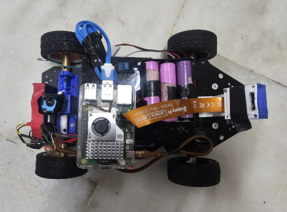
  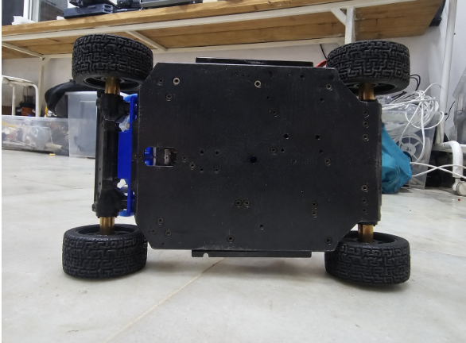

<i>Top and bottom. From above: the Raspberry Pi 5, the cells and the camera ribbon running forward. From below: the metal lower deck, the rear axle rods out to each wheel, and the steering linkage across the front.</i>

  
  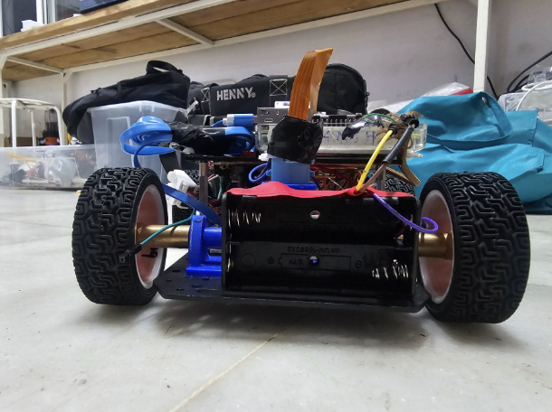
  

---

## Demonstration Videos

Driving test footage is linked from [`video/README.md`](./video/README.md). One video per challenge, both showing the vehicle driving autonomously with nobody touching it.

- **[Open Challenge — Testing Run](https://www.youtube.com/watch?v=eD4r7zBw4Pc)** — ultrasonic wall centring, IMU-held straights, 90° corner turns and lap counting all running together on the practice track.
- **[Obstacle Challenge — Testing Run](https://www.youtube.com/watch?v=VzUp-tTwaB4)** — the full vision pipeline driving the car: red and green pillars detected and passed on the correct side, corner turns gated on the frame being clear, and the IMU squaring the heading up after each turn.

---

## Resources and Acknowledgements

The references, tools and documentation we actually leaned on while building this car.

**Mechanical**

- [Ackermann steering geometry — Wikipedia](https://en.wikipedia.org/wiki/Ackermann_steering_geometry) — the geometry our front axle is built on, and where we went to understand why the inside wheel has to turn further than the outside one.
- [Ackermann turning diagram](https://commons.wikimedia.org/wiki/File:Ackermann_turning.svg) by Andy Dingley, after Bromskloss, via Wikimedia Commons, used under [CC BY-SA 3.0](https://creativecommons.org/licenses/by-sa/3.0/). Cropped for this README.

**Computer vision, colour detection and HSV tuning**

- [OpenCV — Changing Colorspaces](https://docs.opencv.org/4.x/df/d9d/tutorial_py_colorspaces.html) — converting BGR to HSV and tracking a coloured object with `cv.inRange()`. This is the basis of our pillar detection.
- [OpenCV — Thresholding Operations using inRange](https://docs.opencv.org/4.x/da/d97/tutorial_threshold_inRange.html) — HSV thresholding with trackbars for live tuning of the bounds. Our `hsv_tuner.py` is built on this pattern.
- [OpenCV — Contour Features](https://docs.opencv.org/4.x/dd/d49/tutorial_py_contour_features.html) — contour area and bounding boxes, which is how we size a pillar and estimate how close it is.
- [Adafruit Learning System — Raspberry Pi computer vision with OpenCV](https://learn.adafruit.com/raspberry-pi-face-recognition-treasure-box/software) — getting OpenCV installed and running against a Pi camera in the first place.
- [Picamera2 library manual](https://datasheets.raspberrypi.com/camera/picamera2-manual.pdf) — the official manual for capturing frames from the Camera Module 3.

**Electronics and firmware**

- [Adafruit BNO055 Absolute Orientation Sensor](https://learn.adafruit.com/adafruit-bno055-absolute-orientation-sensor) — the sensor guide behind the IMU library we use, including what NDOF fusion mode actually gives you.
- [Adafruit BNO055 Arduino library](https://github.com/adafruit/Adafruit_BNO055) — the library itself.
- [ESP32Servo library](https://github.com/madhephaestus/ESP32Servo) — servo PWM on the ESP32, since the standard Arduino `Servo` library does not work there.
- [ESP32 Arduino core (Espressif)](https://github.com/espressif/arduino-esp32) — the board package that makes the ESP32 programmable from the Arduino IDE.
- [KiCad documentation](https://docs.kicad.org/) — used to draw the schematics in [`schemes/`](./schemes/).

**Competition**

- [World Robot Olympiad Association](https://wro-association.org/) — the rules and season materials for Future Engineers.
- [WRO Future Engineers 2024 team repositories](https://github.com/World-Robot-Olympiad-Association/fe-2024-links) — the official index of past teams' repositories. Reading how previous teams documented their vehicles shaped how we documented ours.

**Thanks**

To our mentors and our schools, The International School Bangalore and National Public School Koramangala, for the workshop time and the support; and to the open source communities behind OpenCV, the Arduino and ESP32 ecosystems, Adafruit and KiCad, all of whose freely published work and documentation this vehicle is built on top of.
