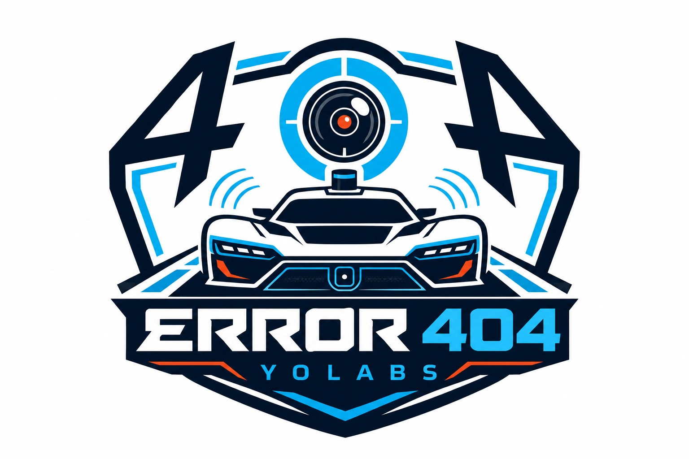

# Yo_Error_404 — WRO Future Engineers 2026

Welcome to the official GitHub repository for **Team Yo_Error_404** (representing **The International School Bangalore** and **National Public School Koramangala**), competing in the **WRO Future Engineers 2026** competition.

---

## About Team Yo_Error_404

**Team Yo_Error_404** brings together three passionate young engineers from **The International School Bangalore (TISB)** and **National Public School, Koramangala (NPS Koramangala)**. Guided by our technical mentors at **YoLab** and supported by our families and schools, our team combines extensive hands-on experience in robotics, computer vision, embedded systems, electronics, and mechanical engineering.

  
   
  

### Team Member Profiles

- **Rohan Mishra (Grade 10 — The International School Bangalore)**:
  Rohan Mishra is a Grade 10 student situated at The International School Bangalore. He has been coding since he was a kid and holds a deep interest in STEM, vision processing algorithms, and basketball. Rohan brings prior competitive experience from an earlier WRO season as well as other national and international robotics events, including **MATE ROV 2026**. On Team Yo_Error_404, Rohan leads the computer vision processing pipeline, real-time HSV color segmentation, OpenCV pillar classification, and high-level autonomous trajectory planning.

- **Anvay Varshney (Grade 10 — National Public School, Koramangala)**:
  Anvay Varshney is a Grade 10 student at National Public School, Koramangala, with a strong passion for robotics, programming, and mechanical engineering. He has been building and experimenting with technology from a young age and has competed in several national and international robotics competitions, including **MATE ROV**. Anvay has taken on leadership roles in robotics teams and at his school, where he actively mentors younger students to foster interest in STEM. On Team Yo_Error_404, Anvay serves as the Embedded Systems & Hardware Architecture Lead, heading 3D CAD mechanical modeling (in Onshape/KiCad), modular chassis fabrication, parallel steering linkage design, and microcontroller integration.

- **Ayansh Paliwal (Grade 9 — The International School Bangalore)**:
  Ayansh Paliwal is a Grade 9 student at The International School Bangalore with a strong passion for robotics, electronics, and engineering. He has participated in numerous competitive robotics and technical events, including competitions organized by **IIT Kanpur**, **IIT Bombay**, and **MATE ROV**. Through these intensive hands-on experiences, Ayansh has developed strong practical skills in hardware prototyping, embedded programming, power electronics, and analytical problem-solving. On Team Yo_Error_404, Ayansh manages power system engineering (3-domain isolated power rails, step-down/step-up power distribution), sensor bus integration (I2C multiplexing, ToF laser timing, BNO055 IMU fusion), firmware development, and rigorous field testing.

---

This repository is organized into two primary versions documenting our complete iterative engineering journey:
- **[`v1/`](./v1/) — Prototype Vehicle (Version 1)**: Initial vehicle design featuring the legacy metal-frame lower deck, HC-SR04 ultrasonic sensors, Ackermann steering linkage, L298N motor driver, dual battery packs, and early software routines.
- **[`v2/`](./v2/) — Final Competition Vehicle (Version 2)**: Fully upgraded competition autonomous vehicle featuring a 3-layer modular acrylic chassis, 4× VL53L0X Time-of-Flight laser sensors via TCA9548A multiplexer, 7semi MD10112 MOSFET motor driver, JGB37-520 motor with magnetic encoder, 20kg DS3218 Digital Servo parallel steering, isolated 3-domain power supply, and 60 FPS OpenCV vision pipeline on Raspberry Pi 5 + ESP32-C3 Super Mini.

---

## Directory Navigation & Structure

| Directory | Vehicle Generation | Description & Included Artifacts |
|:----------|:-------------------|:---------------------------------|
| **[`v1/`](./v1/)** | **Version 1 Prototype** | Legacy prototype codebase (`v1/src/`), 3D STL files (`v1/models/`), circuit schematics (`v1/schemes/`), prototype vehicle photos (`v1/v-photos/`), team photos (`v1/t-photos/`), video links (`v1/video/`), engineering decisions (`v1/docs/Decisions.md`), testing logs (`v1/docs/Testing.md`), and full documentation (`v1/README.md`). |
| **[`v2/`](./v2/)** | **Version 2 Final Vehicle** | Primary competition codebase (`v2/src/`), 31 3D STL CAD models & VTK renders (`v2/models/`), KiCad electrical schematics & pin mapping diagrams (`v2/schemes/`), 6-angle high-res vehicle photos (`v2/v-photos/`), team photos (`v2/t-photos/`), engineering decisions & testing logs (`v2/docs/`), and master engineering report (`v2/README.md`). |

---

## Technical Comparison: Version 1 vs. Version 2

| Subsystem Domain | Version 1 Prototype (`v1/`) | Version 2 Final Vehicle (`v2/`) | Engineering Impact & Improvements |
|:-----------------|:----------------------------|:--------------------------------|:----------------------------------|
| **Compute Architecture** | Single Raspberry Pi 3B+ / ESP32 DevKit V1 | Raspberry Pi 5 (4GB) + ESP32-C3 Super Mini | Control loop increased from inconsistent 45 Hz to deterministic 100 Hz. |
| **Distance Sensing** | 3× HC-SR04 Ultrasonic Sensors | 4× VL53L0X ToF Laser Sensors via TCA9548A | Millimeter precision; zero false sound reflections off angled walls. |
| **Motor Propulsion & Driver** | BO Motor (60/100 RPM) + L298N Driver | JGB37-520 DC Motor (320 RPM) + 7semi MD10112 MOSFET Driver | Active braking distance reduced from 30 cm to 2 cm; linear low-PWM response. |
| **Steering Mechanism** | Ackermann Linkage with 3D-Printed Pivots | Parallel Steering Linkage + 20kg DS3218 Servo + Rear Diff | Zero steering deflection under high-speed cornering; $0^\circ$ joint slop. |
| **Chassis Construction** | 2-Deck Metal Base + Acrylic Upper Deck | 3-Layer Modular Laser-Cut Acrylic Chassis | Sub-5-minute component servicing; vibration isolation between layers. |
| **Drive Transmission** | Standard 3D-Printed PLA Couplers | 100% Infill High-Ductility PETG Couplers | Drive shaft lifespan increased from 8–12 cycles to >100 cycles without failure. |
| **Power Infrastructure** | Dual Li-ion Packs (Shared Rails) | Isolated 3-Domain Power Rails (12V, 7.4V, 3.3V/5V) | 0 logic brownouts across 100+ continuous high-load stress cycles. |
| **Vision & Camera** | Pi Camera Module 3 Static Mount | Pi Camera Module 3 Wide Angle ($120^\circ$ FOV) Top Mast | Vision frame rate increased to 60 FPS; eliminated blind spots up to 150 cm horizon. |

---

## Quick Start & Reproducibility Guide

To explore or build either iteration of our vehicle:

1. **Version 2 Final Vehicle (Recommended)**:
   - Navigate to **[`v2/`](./v2/)** for the complete, up-to-date engineering report in **[`v2/README.md`](./v2/README.md)**.
   - Firmware for Open Round and Obstacle Round is in **[`v2/src/`](./v2/src/)**.
   - Mechanical 3D CAD models and renders are in **[`v2/models/`](./v2/models/)**.
   - Circuit schematics and pin mappings are in **[`v2/schemes/`](./v2/schemes/)**.

2. **Version 1 Prototype (Historical Baseline)**:
   - Navigate to **[`v1/`](./v1/)** for the prototype documentation in **[`v1/README.md`](./v1/README.md)**.
   - Original software scripts are in **[`v1/src/`](./v1/src/)**.
   - Early 3D models and renders are in **[`v1/models/`](./v1/models/)**.

---

## Team Roster & Acknowledgements

- **Rohan Mishra** (Grade 10, The International School Bangalore) — Vision Processing, OpenCV Tuning, Control Algorithms
- **Anvay Varshney** (Grade 10, National Public School Koramangala) — Embedded Systems Lead, Hardware Architecture, 3D Modeling
- **Ayansh Paliwal** (Grade 9, The International School Bangalore) — Power System Design, Firmware Development, System Testing

Special thanks to **YoLab**, **WRO Association**, **India STEM Foundation**, our schools, and our families for their incredible support throughout our engineering journey.
