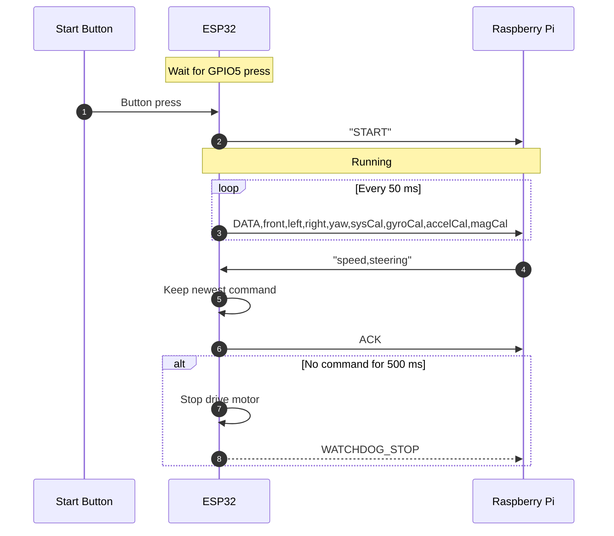
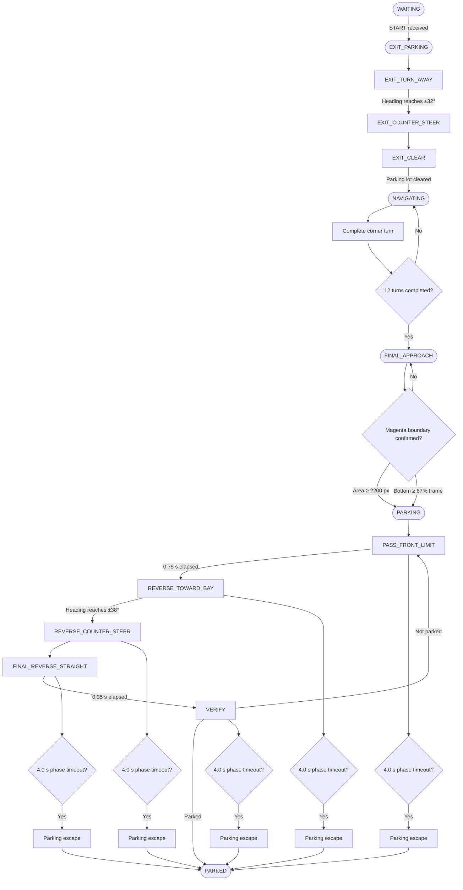
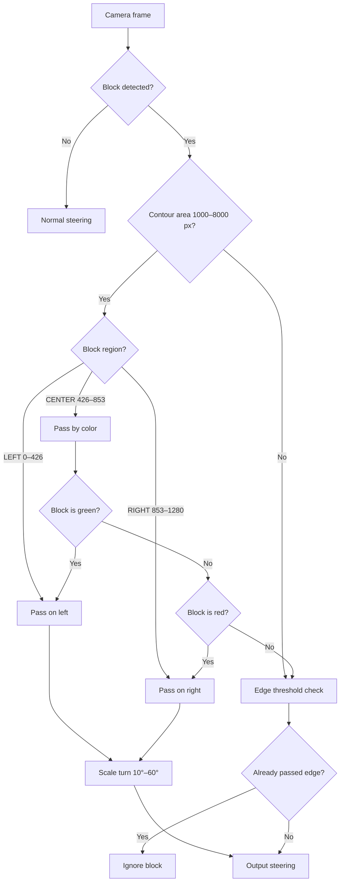
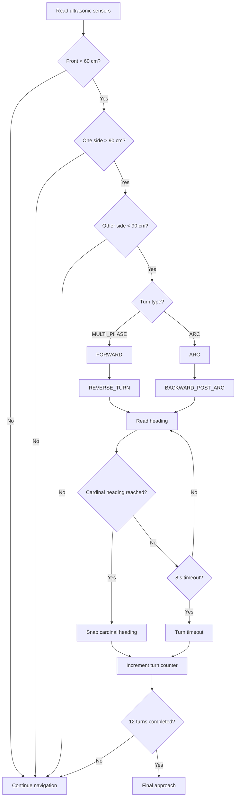
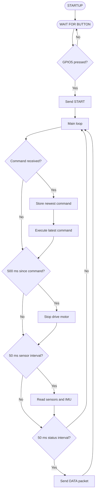

# Obstacle Round Source Code

## What is in this folder

| File | Runs on | What it does |
|:-----|:--------|:-------------|
| `ESP_Code_Slave.ino` | ESP32 | Reads the sensors and drives the motor and steering |
| `Raspberry_Pi_Code_Master.py` | Raspberry Pi 5 | Looks at the camera and decides where to go |
| `testing_calibration_codes/` | Both | Small test tools we used while building the car |

The Pi is the master and the ESP32 is the slave. The Pi makes all the decisions, and the ESP32 only does what it is told and reports what its sensors see.

## How the two parts work together

The Raspberry Pi and the ESP32 are joined by one USB cable and talk at 115200 baud.

The ESP32 owns all the sensors. It reads the three ultrasonic sensors and the BNO055 compass, and sends them to the Pi 20 times a second. The Pi owns the camera. It looks for the coloured blocks, works out a speed and a steering angle, and sends those back. The ESP32 then moves the motor and the servo.

The Pi never talks to the ultrasonic sensors or the compass directly, and the ESP32 never sees the camera.

**What the Pi sends to the ESP32**

One line, `speed,steering`, for example `140,90`. Speed is -255 to 255, where a negative number means reverse. Steering is 30 (full left) to 150 (full right), and 90 is straight.

**What the ESP32 sends to the Pi**

| Message | Meaning |
|:--------|:--------|
| `DATA,front,left,right,yaw,sys,gyro,accel,mag` | Sensor readings, sent every 50 ms. Distances are in cm, yaw is 0-360 degrees, and the last four numbers are the BNO055 calibration levels |
| `START` | The start button has been pressed |
| `ESP32_V2_READY` | The ESP32 has finished booting |
| `BNO055_READY` | The compass was found |
| `ERROR_BNO055_NOT_FOUND` | The compass was **not** found |
| `WATCHDOG_STOP` | No command arrived for 500 ms, so the car stopped itself |

---

## Control Flow & Processing

### 1. System Overview

How the start button, the ESP32 and the Raspberry Pi talk to each other during a run.



### 2. Pi Navigation Mode Machine

The order the car moves through: leaving the parking lot, three laps, then parking again.



### 3. Pillar Avoidance Steering

How the car decides which way to go around a red or green traffic sign pillar.



### 4. Corner Turn Routine

When a corner turn is allowed, and how the two turn types run.



### 5. ESP32 Firmware Loop

What the ESP32 does on every pass of its main loop.



---

## ESP_Code_Slave.ino

This is the ESP32 side. It waits for the start button, then keeps doing three things in a loop: take any new command from the Pi and apply it straight away, read the sensors every 50 ms, and send those readings to the Pi every 50 ms.

If the Pi stops sending commands for half a second, the ESP32 stops the motor and straightens the wheels by itself. This is so the car does not keep driving on an old command if the cable comes loose or the Pi crashes.

### Hardware Requirements

- **ESP32 Dev Board** (ESP32-DEVKIT-V1)
- **DC Drive Motor** for the rear wheel drive
- **MG669R Steering Servo** for the front steering
- **L298N Motor Driver** to switch the drive motor in both directions
- **BNO055 IMU** (9-axis compass)
- **HC-SR04 Ultrasonic Sensors** (3x: front, left, right)
- **Push Button** for the start signal
- **Power Distribution Board** to split the pack into a regulated 5V branch and the raw motor supply
- **Power Supply** (3x Li-ion 18650 battery pack, 11.1V)
- **USB Data Cable** to the Raspberry Pi

### Wiring

| Part | Pin |
|:-----|:----|
| Start button | 5 (other side to GND) |
| Motor forward | 18 |
| Motor reverse | 19 |
| Steering servo | 23 |
| Front ultrasonic | trig 12, echo 14 |
| Left ultrasonic | trig 27, echo 26 |
| Right ultrasonic | trig 33, echo 32 |
| BNO055 compass | SDA 21, SCL 22 (address 0x28) |

The servo angles are 30 for full left, 90 for straight and 150 for full right. These must match the numbers at the top of `Raspberry_Pi_Code_Master.py`.

### Software Setup & Installation Instructions

1. **Install the Arduino IDE** (version 2.0 or higher).
2. **Install the ESP32 board package**:
   - Open the Arduino IDE, go to `Preferences`, and add the Espressif Systems board manager URL.
   - Go to `Board Manager`, search for **ESP32 by Espressif Systems**, and install it.
3. **Install these libraries** from the Library Manager:
   - `ESP32Servo`
   - `Adafruit BNO055`
   - `Adafruit Unified Sensor`
   - `Wire` (already installed with the Arduino IDE)
4. **Upload the code**:
   - Open `src/obstacle_round/ESP_Code_Slave.ino`.
   - Select the board **ESP32 Dev Module**.
   - Select your port and click Upload.
5. **Check it works**: open the Serial Monitor at 115200 baud. You should see `ESP32_V2_READY` and then `BNO055_READY`. If you see `ERROR_BNO055_NOT_FOUND` instead, check the SDA and SCL wiring before going any further.

---

## Raspberry_Pi_Code_Master.py

This is the Raspberry Pi side, and it is where all the driving decisions are made.

### Hardware Requirements

- **Raspberry Pi 5 (4GB)** with a microSD card
- **Raspberry Pi 5 Active Cooler**, because running the camera and OpenCV together makes the Pi throttle itself if it gets hot
- **Pi Camera Module 3 (Wide)** connected to the Pi's camera port
- **ESP32** connected to the Pi by USB (this is the same cable the commands go over)
- **Monitor or VNC session**, because the script opens a camera preview window
- **Power Supply** for the Pi that can handle the Pi 5 (a weak supply will cause random reboots during a run)

### Software Setup & Installation Instructions

1. **Install Raspberry Pi OS** (64-bit) on the Pi 5 and boot it.
2. **Install picamera2** if it is not already there:
   ```bash
   sudo apt update
   sudo apt install -y python3-picamera2
   ```
3. **Install the Python libraries**:
   ```bash
   pip install opencv-python numpy pyserial
   ```
   On newer versions of Raspberry Pi OS you may need to add `--break-system-packages` to that command.
4. **Give yourself permission to use the serial port**, then reboot:
   ```bash
   sudo usermod -a -G dialout $USER
   ```
5. **Check the ESP32 port name**. Plug the ESP32 in and run:
   ```bash
   ls /dev/ttyUSB*
   ```
   If it is not `/dev/ttyUSB0`, change `SERIAL_PORT` at the top of the script.
6. **Change `LOGS_DIR`** near the top of the script to a folder that exists on your Pi. The path in the file is the one from our Pi.
7. **Run it**:
   ```bash
   python3 Raspberry_Pi_Code_Master.py
   ```

The script starts and then waits. Nothing moves until you press the button on the ESP32. When you press it the ESP32 sends `START`, the Pi saves the current compass heading as "straight", and the car begins.

### How it decides where to go

The camera picture is 1280x720 and is split into three up-and-down parts: left, centre and right.

The rules for the coloured blocks are:

- A **red** block must be passed on its right, so the car steers right.
- A **green** block must be passed on its left, so the car steers left.

How hard it steers depends on how big the block looks. A small block is far away, so the car turns gently (about 10 degrees). A big block is close, so the car turns hard (up to 60 degrees). A block in the centre gets a slightly bigger turn, and a block already on the correct side gets a slightly smaller one.

If a block is right at the very edge of the picture the car just goes straight, because it will miss the block anyway.

When there are no blocks in view, the car steers itself back to the straight heading using the compass.

### Turning at the corners

A corner turn only happens when all of these are true:

- No blocks at all are visible
- The front sensor reads less than 60 cm
- One side is open (more than 90 cm) and the other side is closed

There is also one extra rule: the car must go around at least one block between two corner turns. This stops it turning twice in the same corner.

There are two ways it turns, and it picks one by looking at the sensor on the *opposite* side:

- More than 40 cm of space: it goes forward for 0.8 s, then reverses while turning until the compass says it has moved 90 degrees.
- Less than 40 cm of space: it drives forward in an arc until the compass says 90 degrees, then backs up for 0.8 s.

After each turn the heading is snapped to the nearest 90 degrees, so small errors do not add up over three laps.

### Parking

The car starts inside the parking lot. First it does a small exit move: turn away from the wall, counter-steer, then straighten up and start its laps.

After 12 counted turns (that is 3 laps) it switches to parking mode. It looks for the magenta parking walls with the camera, drives past the first one, reverses into the bay in two steps, and then checks that its heading and its distance from the wall are correct before saying it is parked.

### Keys while it is running

| Key | What it does |
|:---:|:-------------|
| `q` | Quit |
| `t` | Cancel the turn it is doing now |
| `r` | Reset the block counter |

### Safety stop

If the sensor readings or the compass readings become more than 1 second old, the car stops. It will not drive on old information.

### Logs

Every run saves a log file and a video into the folder set by `LOGS_DIR`. Set `RECORD_VIDEO = False` near the top of the script to turn the video off.

---

## testing_calibration_codes/

The two tools we used to get the obstacle round hardware working — one to check that the Pi and the ESP32 can actually talk to each other, and one to tune the camera's colour detection.

### rx_tx_test.ino

An echo test for the ESP32. You send it a line of text from the Pi over USB and it sends the same line back with `ECHO:` in front of it. If that works, the cable, the port and the baud rate are all fine, which is worth knowing before you start sending real speed and steering commands.

**Hardware Requirements**

- ESP32 dev board (ESP32-DEVKIT-V1)
- Raspberry Pi 5
- A USB data cable, Pi USB-A to ESP32 micro-USB. A charge-only cable will not work.

**Software Setup & Installation Instructions**

Open `rx_tx_test.ino` in the Arduino IDE and flash it. There are no libraries to install for this one. Board is "ESP32 Dev Module", pick your port, hit upload.

Now plug the ESP32 into the Pi and open the serial port at 115200 baud. You'll need pyserial (`pip install pyserial`):

```bash
python3 -c "import serial; s=serial.Serial('/dev/ttyUSB0',115200,timeout=2); s.write(b'hello\n'); print(s.readline().decode())"
```

On boot the ESP32 prints `ESP32 ready over USB!`. After that, every line you send should come straight back as `ECHO: <your message>`.

If nothing comes back, check the port name with `ls /dev/ttyUSB*` or `ls /dev/ttyACM*`, make sure you're on 115200, and try a different cable.

### hsv_tuner.py

Tunes the HSV colour thresholds for the camera. It shows you three windows side by side — the camera feed, the black and white mask, and the mask applied to the feed — plus six sliders for the upper and lower HSV bounds. Drag the sliders until the thing you're trying to detect shows up solid white in the mask.

There are presets for the three colours we care about: the red and green traffic sign pillars, and the magenta parking lot limiters.

**Hardware Requirements**

- Raspberry Pi 5 with a Camera Module 3. A webcam or a recorded video file works too.
- A monitor plugged into the Pi, or a VNC session. It opens OpenCV preview windows, so it won't run headless.

**Software Setup & Installation Instructions**

```bash
pip install opencv-python numpy

python3 hsv_tuner.py                                       # live camera, green preset
python3 hsv_tuner.py --source block_test.mp4 --color red   # recorded video, red preset
```

**Presets**

| Key | Colour | Lower (H, S, V) | Upper (H, S, V) | What it's for |
|:---:|:-------|:----------------|:----------------|:--------------|
| `1` | Red | `(0, 70, 60)` | `(10, 255, 255)` | Red traffic sign pillar |
| `2` | Green | `(45, 60, 40)` | `(90, 255, 255)` | Green traffic sign pillar |
| `3` | Magenta | `(135, 70, 60)` | `(175, 255, 255)` | Parking lot limiter |

**Keys**

| Key | What it does |
|:---:|:-------------|
| `1` `2` `3` | Load the red / green / magenta preset |
| `p` | Print the current ranges to the terminal |
| `s` | Save the current ranges to `hsv_values.txt` |
| `q` or `ESC` | Quit |

**Tuning**

Put the pillar (or the parking limiter) in front of the camera under the same lighting the car will actually run in — this matters more than anything else, and it's why we re-tune at the venue rather than trusting values from home. Load the closest preset with 1, 2 or 3, then drag the sliders until the mask shows the object as solid white without picking up the background.

Once it looks right, press `p` to print the ranges or `s` to write them to `hsv_values.txt`, then copy them into the detection code.
