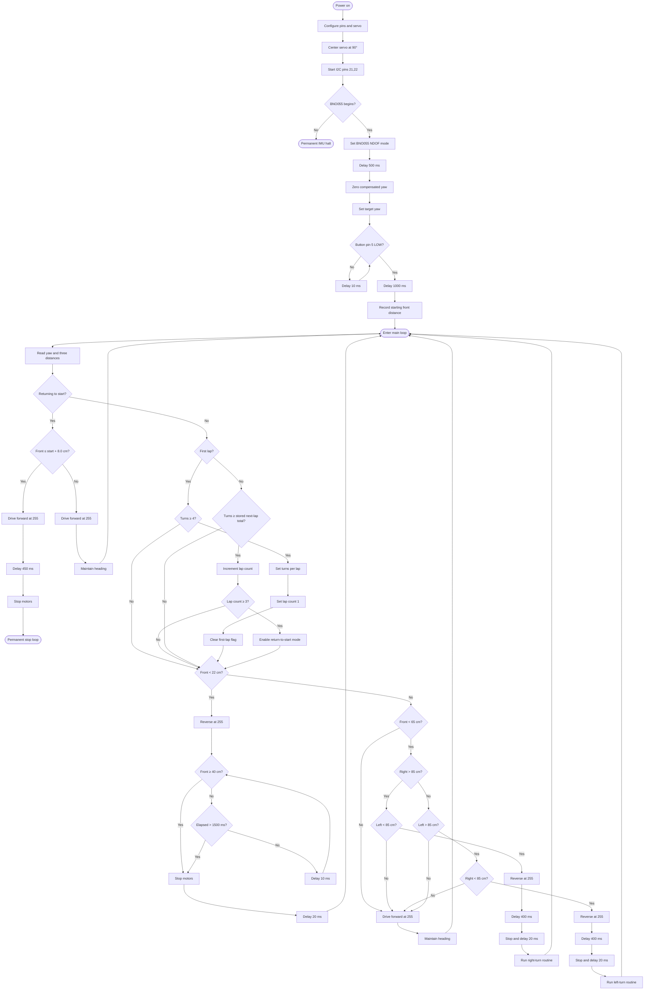

# Open Round Source Code (`src/open_round`)

This directory contains the firmware, control algorithms, and calibration routines for the **ERROR 404** vehicle during the Open Round challenge.

---

## Directory Structure & Files

### 1. `Open_Round.ino`
The main autonomous control script responsible for navigation, wall-following algorithms, IMU heading correction, and reactive obstacle avoidance during Open Round competition runs.

#### ⚙️ Hardware Requirements
- **ESP32 Dev Board** (ESP32-DEVKIT-V1)
- **DC Drive Motor** (Rear Wheel Drive Propulsion)
- **MG669R Steering Servo** (Front Wheel Ackermann Steering)
- **L298N Motor Driver** (Switches the drive motor in both directions)
- **BNO055 IMU** (9-Axis Absolute Orientation Sensor)
- **HC-SR04 Ultrasonic Sensors** (3x: Front, Left, Right)
- **Power Distribution Board** (Splits the pack into a regulated 5V branch and the raw motor supply)
- **Power Supply** (3x Li-ion 18650 Battery Pack / 11.1V Nominal)

#### 🛠️ Software Setup & Installation Instructions
1. **Install Arduino IDE** (v2.0 or higher recommended).
2. **Install ESP32 Board Package**:
   - Open Arduino IDE $\rightarrow$ `Preferences` $\rightarrow$ Add Additional Board Manager URL for Espressif Systems.
   - Go to `Board Manager`, search for **ESP32 by Espressif Systems**, and click **Install**.
3. **Install Required Libraries**:
   - `ESP32Servo.h`
   - `Adafruit BNO055`
   - `utility/imumaths`
   - `Adafruit Unified Sensor`
   - `Wire` (Pre-installed with Arduino IDE)
4. **Flashing Firmware**:
   - Open `src/open_round/Open_Round.ino` in Arduino IDE.
   - Select Board: **ESP32 Dev Module**.
   - Select Port and click **Upload** (Arrow button in top-left).
   - Open **Serial Monitor** (115200 Baud Rate) for debugging and sensor feedback.

> ⚠️ **Important Notes**:
> - Speeds and fixed steering angles must be calibrated for your specific vehicle setup before track runs.
> - Ensure GPIO pin numbers configured in `Open_Round.ino` match your exact physical wiring layout.

#### 🔄 Complete Open-Round Control Flow & Processing
The flowchart below details the complete execution flow, boot initialization, IMU zeroing, turning logic, lap counting, and obstacle reverse routines.

---

### 2. `testing_calibration_codes/`
This folder houses diagnostic scripts used during hardware bring-up and pre-flight testing to verify sensor integrity, motor responses, and steering actuation before autonomous runs.

- **`Full_Bot_Sensor_and_Motor_Test.ino`**:
  A comprehensive diagnostic script that validates the operational status of all onboard sensors and actuators, including the HC-SR04 ultrasonic sensors, BNO055 IMU, steering servo, and main drive motor.

  #### ⚙️ Hardware Requirements
  - **ESP32 Dev Board** (ESP32-DEVKIT-V1)
  - **DC Drive Motor** (Rear Wheel Drive Propulsion)
  - **MG669R Steering Servo** (Front Wheel Ackermann Steering)
  - **L298N Motor Driver** (Switches the drive motor in both directions)
  - **BNO055 IMU** (9-Axis Absolute Orientation Sensor)
  - **HC-SR04 Ultrasonic Sensors** (3x: Front, Left, Right)
  - **Power Distribution Board** (Splits the pack into a regulated 5V branch and the raw motor supply)
  - **Power Supply** (3x Li-ion 18650 Battery Pack / 11.1V Nominal)

  #### 🛠️ Software Setup & Installation Instructions
  1. **Install Arduino IDE** (v2.0 or higher recommended).
  2. **Install ESP32 Board Package**:
     - Open Arduino IDE $\rightarrow$ `Preferences` $\rightarrow$ Add Additional Board Manager URL for Espressif Systems.
     - Go to `Board Manager`, search for **ESP32 by Espressif Systems**, and click **Install**.
  3. **Install Required Libraries**:
     - `ESP32Servo.h`
     - `Adafruit BNO055`
     - `utility/imumaths`
     - `Adafruit Unified Sensor`
     - `Wire` (Pre-installed with Arduino IDE)
  4. **Flashing Diagnostic Code**:
     - Open `src/open_round/testing_calibration_codes/Full_Bot_Sensor_and_Motor_Test.ino` in Arduino IDE.
     - Select Board: **ESP32 Dev Module**.
     - Select Port and click **Upload** (Arrow button in top-left).
     - Open **Serial Monitor** (115200 Baud Rate) to view real-time diagnostic output.

  #### Diagnostic Cycle Workflow
  Upon execution, the script performs a continuous diagnostic loop:
  1. **Sensor Pinging**: Pings the front, left, and right HC-SR04 ultrasonic sensors to report real-time distance measurements.
  2. **IMU Orientation Check**: Reads absolute orientation data from the BNO055 IMU relative to the vehicle's initial heading after a 2-second boot stabilization delay.
  3. **Steering Sweep**: Sweeps the front steering servo across its range of motion (45° $\rightarrow$ 90° $\rightarrow$ 135°) to verify mechanical alignment and smooth actuation.
  4. **Drive Motor Validation**: Cycles the rear drive motor forward, pauses, engages reverse drive, and comes to a complete stop.

  > **Purpose**: Serves as a pre-flight verification tool to quickly confirm that all electrical connections, pin mappings, and hardware components are fully functional before launching autonomous competition code.
