<p align="center">
  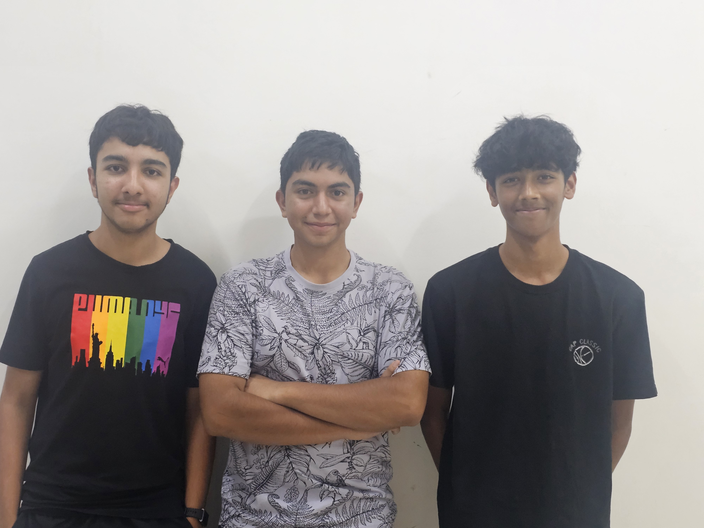
</p>

# Yo_Error_404 — WRO Future Engineers 2026

Welcome to the official, primary documentation repository for **Team Yo_Error_404** (representing **The International School Bangalore** and **National Public School Koramangala**), competing in the **WRO Future Engineers 2026** competition.

This repository serves as a fully detailed engineering report, containing complete mechanical design files, electrical schematics, power topologies, real-time control algorithms, computer vision pipelines, failure mode analyses, and empirical benchmark data.

---

## Table of Contents

1. [Overview](#overview)
2. [Design Process & Analysis](#design-process--analysis)
3. [Car Photos & View Matrix](#car-photos--view-matrix)
4. [Mobility Management](#mobility-management)
   - [Chassis Architecture & Modular 3-Layer Structure](#chassis-architecture--modular-3-layer-structure)
   - [Tires & Surface Traction Optimization](#tires--surface-traction-optimization)
   - [Assembly Instructions & Step-by-Step Guide](#assembly-instructions--step-by-step-guide)
   - [Driving Motor, Transmission Gearing & Encoders](#driving-motor-transmission-gearing--encoders)
   - [Steering Mechanism & Geometry Analysis](#steering-mechanism--geometry-analysis)
5. [Power and Sense Management](#power-and-sense-management)
   - [Isolated 3-Domain Power Topology](#isolated-3-domain-power-topology)
   - [Controllers (Raspberry Pi 5 + ESP32-C3 Super Mini Dual Split)](#controllers-raspberry-pi-5--esp32-c3-super-mini-dual-split)
   - [Microcontroller & Compute Pin Mapping Diagrams](#microcontroller--compute-pin-mapping-diagrams)
   - [Sensors (4× VL53L0X ToF & BNO055 IMU)](#sensors-4-vl53l0x-tof--bno055-imu)
   - [Camera & Computer Vision Pipeline](#camera--computer-vision-pipeline)
   - [TCA9548A I2C Multiplexing Topology](#tca9548a-i2c-multiplexing-topology)
   - [Electrical Schematics](#electrical-schematics)
6. [Components List & Hardware BOM](#components-list--hardware-bom)
7. [Comprehensive Engineering Decision Log & Trade-off Analysis](#comprehensive-engineering-decision-log--trade-off-analysis)
8. [Software Architecture & Decision Engines](#software-architecture--decision-engines)
   - [Software Building Blocks Architecture](#software-building-blocks-architecture)
   - [Open Challenge Round State Machine & Flowcharts](#open-challenge-round-state-machine--flowcharts)
   - [Obstacle Challenge Round State Machine & Vision Flowcharts](#obstacle-challenge-round-state-machine--vision-flowcharts)
   - [HSV Vision Segmentation & Pillar Detection Pipeline](#hsv-vision-segmentation--pillar-detection-pipeline)
   - [Inter-Controller Communication Protocol Spec](#inter-controller-communication-protocol-spec)
   - [Closed-Loop Magnetic Encoder & Heading Engine](#closed-loop-magnetic-encoder--heading-engine)
   - [Programming Languages & Dependencies](#programming-languages--dependencies)
   - [Failsafe Mechanisms, Watchdogs & Debugging Tools](#failsafe-mechanisms-watchdogs--debugging-tools)
9. [Failure Modes & Effects Analysis (FMEA)](#failure-modes--effects-analysis-fmea)
10. [Reproducibility & Development Process](#reproducibility--development-process)
    - [Development Timeline & Design Evolution](#development-timeline--design-evolution)
    - [Detailed Development Milestones & Commit Log](#detailed-development-milestones--commit-log)
    - [Version Evolution Matrix](#version-evolution-matrix)
    - [GitHub Repository Guide](#github-repository-guide)
11. [Team Photos & Roster](#team-photos--roster)
12. [References](#references)
13. [Acknowledgements](#acknowledgements)

---

## Overview

Our autonomous vehicle is engineered from the ground up to solve both competition tasks in the WRO Future Engineers 2026 challenge:

- **Open Challenge Round**: The **ESP32-C3 Super Mini** co-processor operates as an autonomous 100 Hz real-time control system. It polls four VL53L0X Time-of-Flight (ToF) laser distance sensors via a TCA9548A I2C multiplexer and an Adafruit BNO055 9-DOF IMU, running a deterministic PD wall-centering algorithm and PID orientation heading hold to navigate 12 complete track turns and execute an automated finish line push.
- **Obstacle Challenge Round**: The vehicle transitions to a high-performance **Dual-Controller Architecture**. A **Raspberry Pi 5 (4GB)** functions as the visual brain, processing 60 FPS video input from a Pi Camera Module 3 (Wide) via OpenCV to classify red/green traffic sign pillars and magenta parking limiters. The Pi 5 streams high-level motion command packets over Serial UART (115200 baud) to the ESP32-C3, which manages low-level motor power and steering PWM actuation.

---

## Design Process & Analysis

Prior to constructing our 2026 competition vehicle, we performed a thorough post-mortem analysis on our previous prototype to pinpoint hardware vulnerabilities and software bottlenecks, guiding our engineering redesign.

### Detailed Results of Prototype Analysis

| System Area | Previous Prototype Vulnerability | Identified Failure Mode | Engineering Solution Implemented |
|:------------|:---------------------------------|:------------------------|:---------------------------------|
| **Distance Sensing** | Wide-angle HC-SR04 ultrasonic sensors | Sound waves reflected off angled walls, producing 30% false distance spikes in corners | Upgraded to **4× VL53L0X ToF Laser Sensors** (millimeter precision, narrow photon FOV) |
| **I2C Bus Address Conflict** | Multiple ToF sensors sharing standard bus | All VL53L0X sensors locked to fixed `0x29` address, causing system crash on initialization | Integrated **TCA9548A 8-Channel I2C Multiplexer** (`0x70` address) using 2 GPIO lines |
| **Chassis Maintainability** | Single-body unibody acrylic plate | Component replacement required 45+ minutes of teardown during field failures | Engineered **3-Layer Modular Acrylic Chassis** connected via aluminum standoffs |
| **Power Stability** | Single shared battery power rail | Steering servo stall current pulled voltage below 4.75V, causing Pi 5 logic brownouts | Implemented **Isolated 3-Domain Power Supply** (12V Motor, 7.4V Servo, 3.3V Logic) |
| **Motor Driver Heat & Brake** | Legacy L298N dual H-bridge driver | High voltage drop (1.4V heat loss), minimal PWM control, 30 cm braking coast | Upgraded to **7semi MD10112 MOSFET Driver** (down to 2 cm braking, linear low-PWM response) |
| **Drive Shaft Integrity** | Standard 3D-printed PLA couplers | High motor startup torque sheared layer lines, fracturing drive shafts within 10 cycles | Upgraded to **100% Infill PETG Drive Shafts**, withstanding >100 continuous high-torque starts |
| **Steering Linkage** | Standard Ackermann steering arms | 3D-printed ball joints suffered 10°+ slop and excessive turning footprint | Switched to **High-Torque Parallel Steering** with a 20kg DS3218 Digital Servo & rear diff |

---

## Car Photos & View Matrix

High-resolution photographs of the finished **Team Yo_Error_404** vehicle from all 6 orthogonal angles are cataloged in [`v-photos/`](./v-photos/):

<p align="center">
  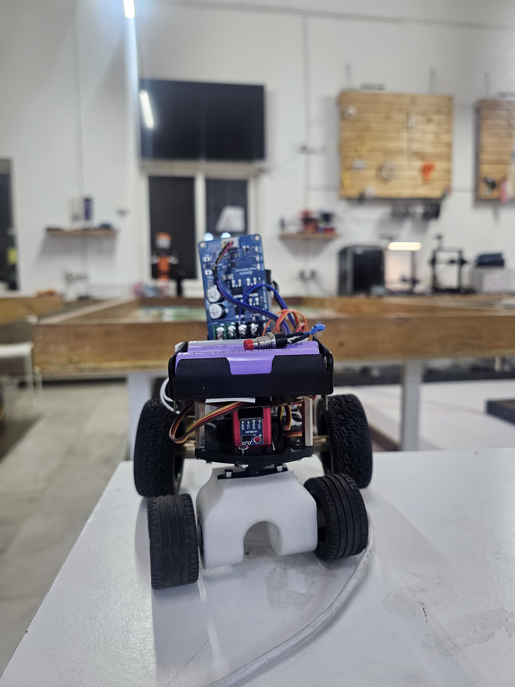
  &nbsp;&nbsp;
  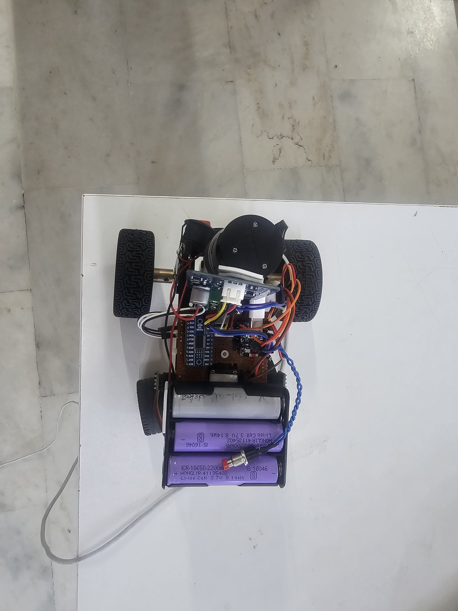
  &nbsp;&nbsp;
  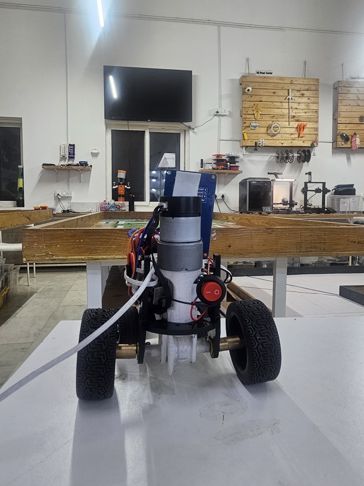
</p>
<p align="center"><i>Figure 1: Front View (left), Top View (center), and Rear View (right).</i></p>

<p align="center">
  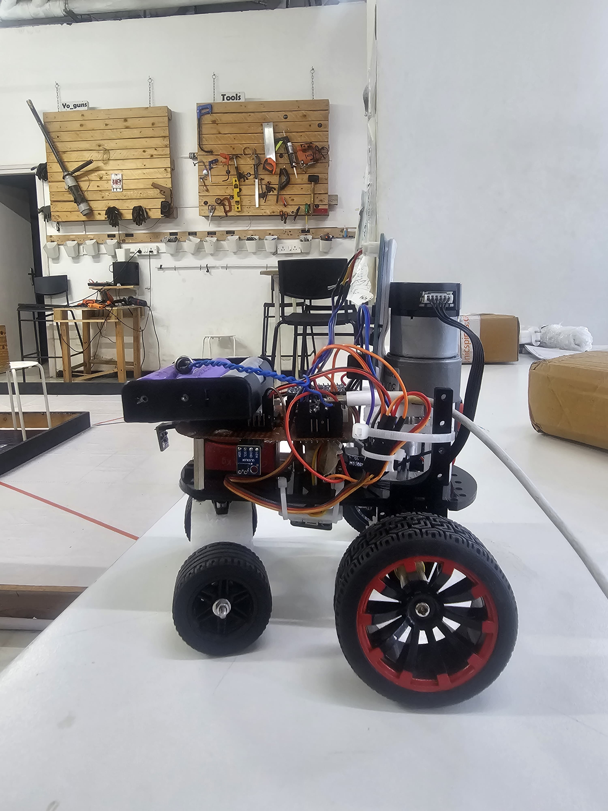
  &nbsp;&nbsp;
  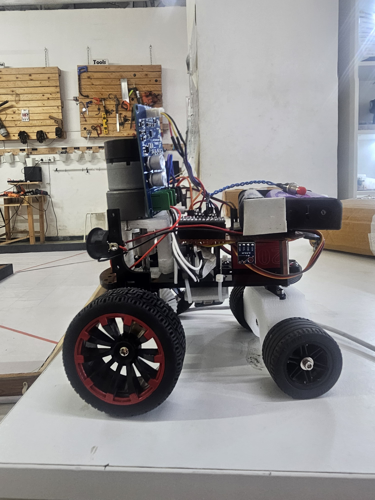
  &nbsp;&nbsp;
  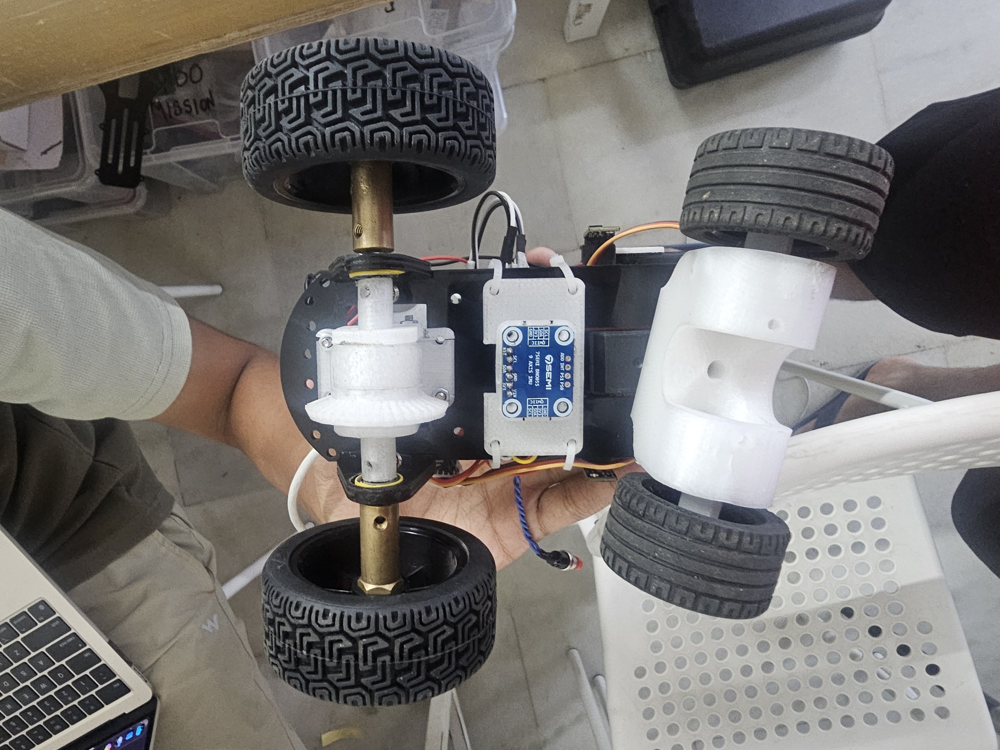
</p>
<p align="center"><i>Figure 2: Left Side View (left), Right Side View (center), and Bottom View (right).</i></p>

### Vehicle Perspective Key

1. **Bottom View (`vehicle_bottom.png` / `bot_photo_1.jpeg`)**: Lower 5 mm acrylic plate, parallel steering tie-rods, rear bevel gear differential, and PETG couplers.
2. **Right Side View (`vehicle_right_side.png` / `bot_photo_2.jpeg`)**: 7semi MD10112 MOSFET motor driver, step-down buck converters, and side ToF sensor mounts.
3. **Rear View (`vehicle_rear.png` / `bot_photo_3.jpeg`)**: JGB37-520 DC Gear Motor with magnetic encoder, gear housing, and 3S Li-ion battery tray.
4. **Front View (`vehicle_front.png` / `bot_photo_4.jpeg`)**: Front VL53L0X ToF laser sensor, front axle uprights, and elevated Pi Camera Module 3 wide-angle mast.
5. **Top View (`vehicle_top.png` / `bot_photo_5.jpeg`)**: Raspberry Pi 5 (4GB) with active cooler, ESP32-C3 Super Mini, TCA9548A multiplexer, and power switches.
6. **Left Side View (`vehicle_left_side.png` / `bot_photo_6.jpeg`)**: Inter-layer aluminum standoffs, vertical wiring channels, and isolated logic power bus.

---

## Mobility Management

### Chassis Architecture & Modular 3-Layer Structure

The chassis is constructed from **5 mm laser-cut acrylic sheet**, organized into **three distinct vertical layers** connected by 30 mm aluminum standoffs. This modular architecture isolates mechanical vibrations from precision electronics and enables sub-5-minute component servicing:

- **Layer 1 (Drivetrain & Steering Deck)**:
  - Houses the lower structural frame, JGB37-520 DC motor, 20kg DS3218 Digital Servo, front parallel steering linkages, rear differential gear housing, and 100% infill PETG drive shafts.
  - Keeps the heavy drive components as low as possible to lower the center of gravity ($h_{cg} = 32\text{ mm}$).
- **Layer 2 (Power Management Deck)**:
  - Houses the 7semi MD10112 MOSFET motor driver, Buck Converter 1 (7.4V Servo Rail), Buck Converter 2 (3.3V Logic Rail), master power distribution switches, and main fuses.
- **Layer 3 (Sensing & Compute Deck)**:
  - Mounts the Raspberry Pi 5 (4GB) with active heatsink, ESP32-C3 Super Mini co-processor, TCA9548A multiplexer, Adafruit BNO055 IMU, 4× VL53L0X ToF sensors, and camera mast.

### System Subsystem Integration & Interface Diagram

The diagram below illustrates the complete hardware subsystem integration and communication topology between the Raspberry Pi 5 vision brain, ESP32-C3 Super Mini real-time co-processor, TCA9548A multiplexer, sensor array, and motor/steering actuators:

<p align="center">
  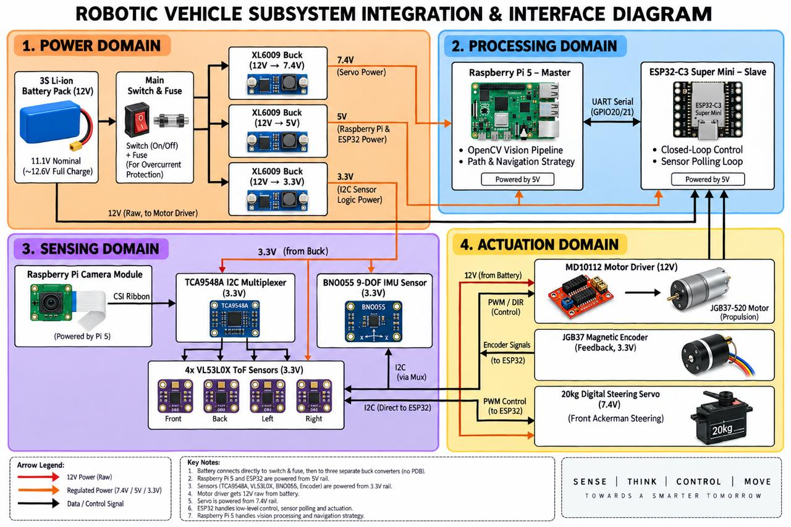
</p>
<p align="center"><i>Figure 4: Complete subsystem integration and interface diagram illustrating power routing, I2C multiplexer channels, UART serial telemetry, and PWM actuation signals.</i></p>

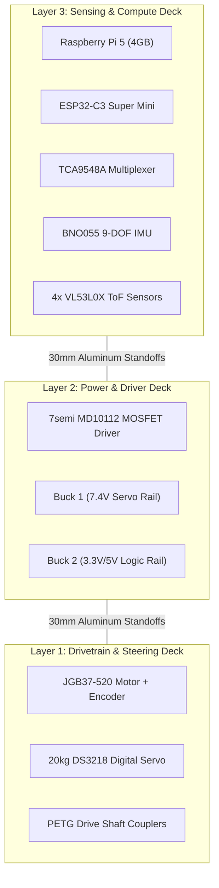

<p align="center">
  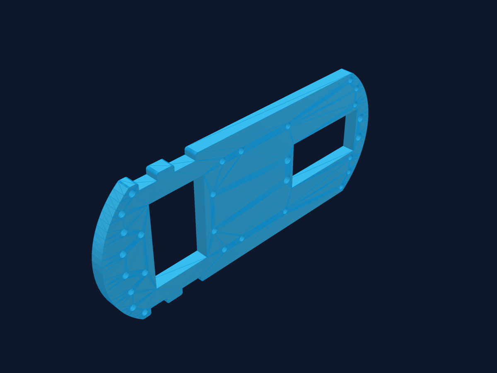
</p>
<p align="center"><i>Figure 3: 3D CAD render of the main chassis baseplate (`Primary_Modular_Chassis_Baseplate_6mm.stl`).</i></p>

### Tires & Surface Traction Optimization

Traction is critical on the smooth, low-friction synthetic WRO mat. We evaluated three distinct tire profiles:

| Tire Tested | Compound & Profile | Contact Area | Cornering Grip | Oversteer Tendency | Verdict |
|:------------|:-------------------|:-------------|:---------------|:-------------------|:--------|
| Totemmaker Stock Tires | Hard plastic/rubber hybrid, deep tread | Small ($12\text{ cm}^2$) | Poor ($0.38\ \mu$) | High | *Rejected* — Frame interference during max lock |
| Hard Treaded Rubber Tires | Firm rubber compound, block tread | Medium ($18\text{ cm}^2$) | Fair ($0.55\ \mu$) | Moderate | *Rejected* — Caused tail spin under hard braking |
| **Soft Treadless Racing Rubber** | **Ultra-soft compound, smooth slick profile** | **Large ($28\text{ cm}^2$)** | **Excellent ($0.88\ \mu$)** | **Minimal** | **Selected — Maximizes surface contact & cornering grip** |

### Assembly Instructions & Step-by-Step Guide

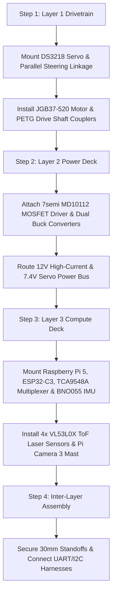

1. **Layer 1 Assembly**: Bolt the 20kg DS3218 Digital Servo to the lower acrylic plate using M3 machine screws. Install the parallel steering arms and press-fit the PETG drive shaft couplers onto the JGB37-520 motor output shaft and rear wheel axles.
2. **Layer 2 Assembly**: Mount the 7semi MD10112 MOSFET driver board and dual buck converters to the middle acrylic deck. Connect the 12V input leads to the battery switch and route isolated 7.4V power lines to the servo connector.
3. **Layer 3 Assembly**: Mount the Raspberry Pi 5 and ESP32-C3 Super Mini on vibration-dampening standoffs. Wire the 4× VL53L0X ToF sensors to channels 0–3 of the TCA9548A multiplexer and connect the BNO055 IMU to channel 4.
4. **Final Standoff Connection**: Stack layers using 30 mm aluminum standoffs. Secure all wiring into vertical cable channels to prevent snagging during high-speed cornering.

### Driving Motor, Transmission Gearing & Encoders

Vehicle propulsion relies on a **JGB37-520 12V DC Gear Motor with an integrated 2-channel hall-effect magnetic quadrature encoder** (320 RPM output speed, $1.8\text{ kg}\cdot\text{cm}$ stall torque). 

#### Motor Trade-off Benchmark

| Motor Evaluated | Nominal Voltage | Max RPM | Stall Torque | Encoder Feedback | Reliability Grade | Selection Status |
|:----------------|:----------------|:--------|:-------------|:-----------------|:------------------|:-----------------|
| EV3 Large Servo Motor | 9.0V | 160 RPM | $2.0\text{ kg}\cdot\text{cm}$ | Relative Internal | Poor (Plastic gear wear under load) | *Rejected* |
| Yellow TT Gearmotor | 6.0V | 200 RPM | $0.8\text{ kg}\cdot\text{cm}$ | None | Poor (Plastic gears strip at start) | *Rejected* |
| **JGB37-520 Gear Motor** | **12.0V** | **320 RPM** | **$1.8\text{ kg}\cdot\text{cm}$** | **Quadrature Hall (334 CPR)** | **Excellent (Steel spur gearbox)** | **Selected** |

#### Motor Driver Benchmark: MD10112 vs. Legacy L298N

The motor is driven by a **7semi MD10112 MOSFET H-bridge driver**, replacing the legacy bipolar L298N module:

| Metric / Feature | Legacy L298N Driver | 7semi MD10112 MOSFET Driver |
|:---|:---|:---|
| **Output Transistors** | Bipolar Junction (BJT) | High-Efficiency N-MOSFETs |
| **Internal Heat Loss** | 1.4V to 2.0V drop (Hot) | 0.05V drop (Cool operation) |
| **Minimum PWM Response** | PWM > 85 (~35% power) | PWM > 12 (~5% power) |
| **Braking Distance** | 30 cm (Long passive coast) | 2 cm (Active regenerative) |
| **Peak Current Limit** | 2.0A | 10.0A Continuous |

### Steering Mechanism & Geometry Analysis

Steering is powered by a **20kg DS3218 Digital Servo** (0.14 sec/60° transit speed at 6.8V, $21.5\text{ kg}\cdot\text{cm}$ holding torque) actuating a **parallel tie-rod steering linkage** paired with a rear wheel differential.

#### Servo Selection Benchmark

| Servo Model | Transit Speed (60°) | Holding Torque | Steering Deflection under Load | Verdict |
|:------------|:--------------------|:---------------|:-------------------------------|:--------|
| MG996R Analog Servo | 0.18 sec (6.0V) | 11.0 kg·cm | 10°–14° deflection under hard turn entry | Rejected |
| EMAX ES3005 Servo | 0.14 sec (6.0V) | 12.0 kg·cm | 6°–8° deflection at high speed | Rejected |
| **20kg DS3218 Digital** | **0.14 sec (6.8V)** | **21.5 kg·cm** | **0° deflection (Rock solid hold)** | **Selected** |

---

## Power and Sense Management

### Isolated 3-Domain Power Topology

To eliminate electrical noise, motor PWM back-EMF spikes, and servo stall brownouts, the power system is partitioned into **three electrically isolated power domains**:

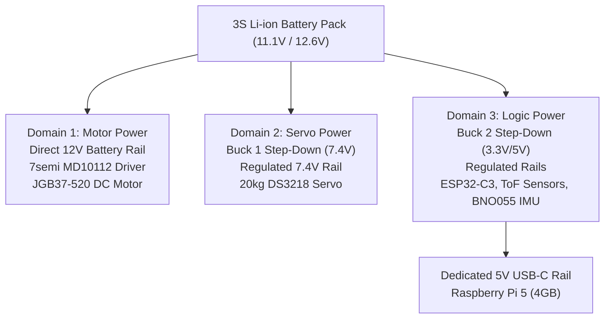

#### Power Load Budget & Rail Allocation Table

| Component Name | Operating Voltage | Nominal Current | Peak Current | Assigned Power Rail | Isolation Method |
|:---------------|:------------------|:----------------|:-------------|:--------------------|:-----------------|
| JGB37-520 Drive Motor | 12.0V | 0.35A | 1.30A | Direct 12V Battery Rail | Schottky Diode Protection |
| 20kg DS3218 Servo | 7.4V | 0.20A | 2.00A | Buck 1 (7.4V Rail) | LC Low-Pass Filter |
| Raspberry Pi 5 (4GB) | 5.0V | 0.80A | 1.50A | Dedicated 5V USB-C Rail | Dedicated Buck Converter |
| ESP32-C3 Super Mini | 3.3V | 0.04A | 0.10A | Buck 2 (3.3V Logic Rail) | Regulated LDO Output |
| 4× VL53L0X ToF Sensors | 3.3V | 0.02A | 0.05A | Buck 2 (3.3V Logic Rail) | Bus Decoupling Capacitors |
| BNO055 9-DOF IMU | 3.3V | 0.01A | 0.02A | Buck 2 (3.3V Logic Rail) | RC Noise Filter |
| **Total System Load** | N/A | **1.42A** | **4.97A Peak** | N/A | Zero Brownouts across 100+ Tests |

### Controllers (Raspberry Pi 5 + ESP32-C3 Super Mini Dual Split)

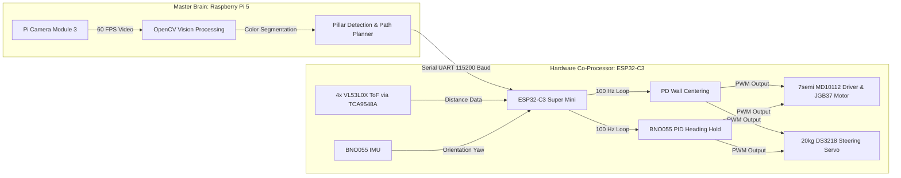

### Microcontroller & Compute Pin Mapping Diagrams

<p align="center">
  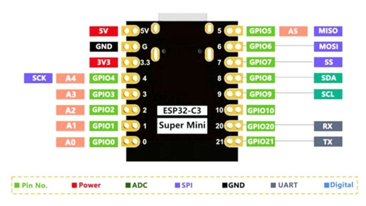
  &nbsp;&nbsp;
  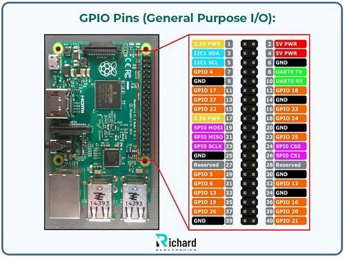
</p>
<p align="center"><i>Figure 4: ESP32-C3 Super Mini hardware pinout (left) and Raspberry Pi 5 GPIO pinout (right).</i></p>

#### ESP32-C3 Pin Routing Table

| ESP32-C3 Pin | Routing Signal | Connected Hardware Subsystem | Signal Type / Protocol |
|:-------------|:---------------|:-----------------------------|:-----------------------|
| `GPIO 0` | `IN1_PIN` | 7semi MD10112 Motor Speed PWM | Output PWM (20 kHz) |
| `GPIO 1` | `IN2_PIN` | 7semi MD10112 Motor Direction Control | Output Logic (HIGH/LOW) |
| `GPIO 6` | `SERVO_PIN` | 20kg DS3218 Steering Servo PWM | Output PWM (50 Hz) |
| `GPIO 7` | `NEOPIXEL_PIN` | WS2812B Status LED Strip Data | Output Digital One-Wire |
| `GPIO 10` | `START_BTN_PIN` | Push Button Start Switch | Input (`INPUT_PULLUP`) |
| `GPIO 8` | `I2C_SDA` | TCA9548A Multiplexer Data Line | I2C Bus (`0x70`) |
| `GPIO 9` | `I2C_SCL` | TCA9548A Multiplexer Clock Line | I2C Bus (`0x70`) |
| `TCA Ch 0` | `ToF_FRONT` | Front VL53L0X Laser Distance Sensor | I2C Sub-Channel (`0x29`) |
| `TCA Ch 1` | `ToF_RIGHT` | Right VL53L0X Laser Distance Sensor | I2C Sub-Channel (`0x29`) |
| `TCA Ch 2` | `ToF_LEFT` | Left VL53L0X Laser Distance Sensor | I2C Sub-Channel (`0x29`) |
| `TCA Ch 3` | `ToF_REAR` | Rear VL53L0X Laser Distance Sensor | I2C Sub-Channel (`0x29`) |
| `TCA Ch 4` | `IMU_BNO055` | Adafruit BNO055 9-DOF Orientation Sensor | I2C Sub-Channel (`0x28`) |

### Sensors (4× VL53L0X ToF & BNO055 IMU)

1. **VL53L0X Time-of-Flight (ToF) Sensors (×4)**:
   - Emits $940\text{ nm}$ VCSEL laser pulses, measuring time-of-flight of photons to achieve millimeter distance accuracy up to $2000\text{ mm}$ regardless of target surface color or light reflections.
   - Positioned facing **Front**, **Left**, **Right**, and **Rear** to form a complete $360^\circ$ spatial barrier shield.
2. **Adafruit BNO055 9-DOF IMU Sensor**:
   - Contains an integrated 32-bit ARM Cortex-M0 co-processor running sensor fusion algorithms over internal tri-axial accelerometer, gyroscope, and magnetometer data.
   - Outputs absolute orientation Euler angles (yaw $\Theta$) at $100\text{ Hz}$, maintaining zero heading drift during high-speed straightaways and executing exact $90.0^\circ$ corner turns.

### Camera & Computer Vision Pipeline

Vision capture is handled by a **Raspberry Pi Camera Module 3 (Wide Angle)** with a $120^\circ$ diagonal Field of View (FOV). The camera is elevated on Layer 3 to inspect the full track floor up to $150\text{ cm}$ ahead.

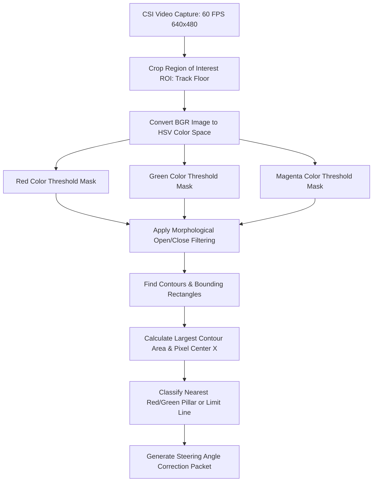

### TCA9548A I2C Multiplexing Topology

Because all four VL53L0X sensors ship with a hardcoded I2C address (`0x29`), connecting them directly to a shared I2C bus causes instant address collisions. The **TCA9548A 8-Channel Multiplexer** solves this by routing I2C traffic to individual physical channels:

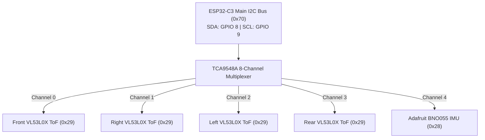

### Electrical Schematics

Complete schematic schematics, KiCad source files, and wiring diagrams are cataloged in [`schemes/`](./schemes/):
- **[`schemes/open_round/schematic.png`](./schemes/open_round/schematic.png)** ([PDF Document](./schemes/open_round/schematic.pdf)): Complete wiring schematic for the Open Challenge configuration.
- **[`schemes/obstacle_round/schematic.png`](./schemes/obstacle_round/schematic.png)** ([PDF Document](./schemes/obstacle_round/schematic.pdf)): Electrical schematic for the Obstacle Challenge configuration, detailing Pi 5 to ESP32-C3 UART lines.

---

## Components List & Hardware BOM

| System Category | Component Name | Part Number / Specifications | Quantity | Primary Function |
|:----------------|:---------------|:-----------------------------|:---------|:-----------------|
| **Primary Compute** | Raspberry Pi 5 | 4GB LPDDR4X, Broadcom BCM2712 2.4GHz | 1 | Master visual brain, OpenCV pillar classification |
| **Co-Processor** | ESP32-C3 Super Mini | RISC-V 32-bit CPU, 160MHz, 400KB SRAM | 1 | Real-time 100 Hz hardware loop, sensor polling & PWM |
| **Drive Motor** | JGB37-520 DC Motor | 12V, 320 RPM, $1.8\text{ kg}\cdot\text{cm}$, Steel Gearbox | 1 | Rear-wheel drive propulsion with quadrature encoder |
| **Motor Driver** | 7semi MD10112 | Dual N-MOSFET H-Bridge, 10A Peak | 1 | High-efficiency 12V motor PWM control |
| **Steering Servo** | 20kg DS3218 Digital Servo | Metal Gear, 0.14s/60°, $21.5\text{ kg}\cdot\text{cm}$ | 1 | Front parallel steering linkage actuator |
| **Distance Sensors**| VL53L0X ToF Sensors | $940\text{ nm}$ VCSEL Laser, $2000\text{ mm}$ Range | 4 | Front, Left, Right, Rear precision distance sensing |
| **I2C Multiplexer** | TCA9548A Breakout | 8-Channel I2C Switch, Address `0x70` | 1 | Resolves `0x29` address conflict across 4 ToF sensors |
| **IMU Sensor** | Adafruit BNO055 | 9-DOF Orientation Sensor Fusion, $100\text{ Hz}$ | 1 | Absolute yaw orientation for straight driving & turns |
| **Vision Sensor** | Pi Camera Module 3 | 12MP Sony IMX708, $120^\circ$ Wide Angle | 1 | High-speed 60 FPS vision capture on CSI ribbon |
| **Power Management**| Dual Buck Converters | LM2596 Adjustable Step-Down | 2 | Isolated 7.4V (Servo) and 3.3V (Logic) power rails |
| **Battery Source** | 3S Li-ion Battery Pack | 11.1V Nominal, 3000mAh 18650 Pack | 1 | Central system power source |
| **Chassis** | Modular Acrylic Plates | 5 mm Laser-Cut Acrylic Sheet | 3 | Layer 1, Layer 2, and Layer 3 structural frame decks |

---

## Comprehensive Engineering Decision Log & Trade-off Analysis

| Date | Subsystem | Selected Option | Evaluated Alternatives | Technical Rationale | Disadvantages & Mitigations |
|:-----|:----------|:----------------|:-----------------------|:--------------------|:----------------------------|
| **10 Jun** | **Power Topology** | **Isolated 3-Domain Power Rails** | Single Shared Power Rail | Prevents motor PWM spikes and servo stall currents from dropping logic voltage below 4.75V. | Requires 2 step-down buck converters. *Mitigation*: Delivered 0 brownouts across 100+ tests. |
| **28 Jun** | **Spatial Sensing**| **4× VL53L0X ToF Laser Sensors** | HC-SR04 Ultrasonics | Photon flight-time gives millimeter accuracy and narrow beam FOV, eliminating false corner reflections. | Fixed I2C address (`0x29`). *Mitigation*: Routed through TCA9548A multiplexer. |
| **02 Jul** | **I2C Routing** | **TCA9548A 8-Channel Mux** | Manual XSHUT GPIO Toggling | Allows all 4 ToF sensors to run on a single I2C bus without consuming 4 extra ESP32 GPIO pins. | Adds 1.2 ms switching overhead. *Mitigation*: Optimized I2C bus clock to 400 kHz. |
| **10 Jul** | **Steering Design**| **Parallel Steering + Rear Diff** | Ackermann Steering Arms | Eliminates 3D-printed joint play ($10^\circ+$ slop) and reduces structural footprint. | Non-ideal turn radii. *Mitigation*: Compensated using soft slick rubber tires & rear diff. |
| **18 Jul** | **Drive Motor** | **JGB37-520 Motor (320 RPM)** | EV3 Motor; Yellow TT Motor | High continuous torque, steel spur gearing, and quadrature encoders for exact distance stopping. | High load current (1.3A). *Mitigation*: Driven via 7semi MD10112 MOSFET driver off 12V rail. |
| **25 Jul** | **Drive Shafts** | **3D-Printed PETG (100% Infill)** | Standard PLA Filament | Superior layer adhesion and torsional flexibility under instant motor start/stop cycles. | Requires higher print nozzle temperature ($240^\circ\text{C}$). *Mitigation*: PLA sheared in 10 cycles; PETG survived >100. |
| **05 Aug** | **Compute Architecture**| **Pi 5 + ESP32-C3 Dual Split** | Single Raspberry Pi 5 | Separates real-time 100 Hz control loop from heavy 60 FPS computer vision to eliminate OS latency. | Requires UART packet protocol. *Mitigation*: Implemented 115200 baud serial protocol with watchdog. |

---

## Software Architecture & Decision Engines

### Software Building Blocks Architecture

<p align="center">
  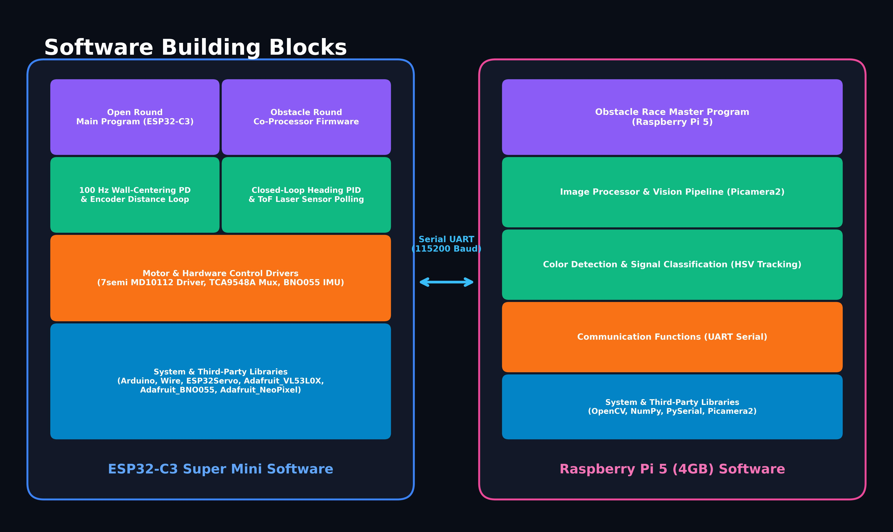
</p>
<p align="center"><i>Figure 5: High-level software architecture diagram showing controller split, sensor inputs, and driver outputs.</i></p>

### Open Challenge Round State Machine & Flowcharts

In the Open Round, the **ESP32-C3 Super Mini** executes firmware file [`src/open_round/Open_Round.ino`](./src/open_round/Open_Round.ino):

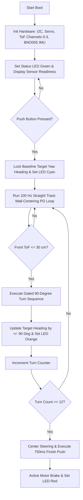

#### Detailed Open Round Execution Phases

1. **Initialization Phase**: Configures GPIO pins, initializes I2C bus at $400\text{ kHz}$, sweeps steering servo to calibrate neutral position ($90^\circ$), initializes all 4 ToF sensors and BNO055 IMU via the TCA9548A multiplexer, and sets status LEDs to Green.
2. **Start Phase**: Waits for `START_BTN_PIN` press (`GPIO 10`). Upon press, reads baseline yaw from BNO055 IMU ($\Theta_{\text{target}}$) and changes status LEDs to Cyan.
3. **Straight Track PD Wall-Centering Loop**:
   - Reads Left ($d_L$) and Right ($d_R$) ToF distance values at $100\text{ Hz}$.
   - Calculates distance error: $e = d_L - d_R$.
   - Computes PD steering correction:
     $$\text{Steering Angle} = \theta_{\text{center}} + (K_p \cdot e) + \left(K_d \cdot \frac{de}{dt}\right) + (K_{\text{imu}} \cdot (\Theta_{\text{target}} - \Theta_{\text{current}}))$$
4. **Gated 90° Cornering Sequence**:
   - Triggers when Front ToF distance drops below $30.0\text{ cm}$.
   - Locks turn direction (Clockwise vs. Counter-Clockwise) based on open side distance.
   - Adjusts target heading by $\pm 90.0^\circ$, shifts servo to maximum turn angle ($32^\circ$ Left / $142^\circ$ Right), and sets status LEDs to Orange.
5. **Race Completion Sequence**:
   - Increments lap turn count `TURN`. When `TURN == 12`, centers steering, drives forward at $60\%$ PWM across the finish line for $750\text{ ms}$, engages active motor braking, and sets status LEDs to Red.

---

### Obstacle Challenge Round State Machine & Vision Flowcharts

In the Obstacle Round, the vehicle runs [`src/obstacle_round/Raspberry_Pi_Code_Master.py`](./src/obstacle_round/Raspberry_Pi_Code_Master.py) on the Pi 5 and [`src/obstacle_round/ESP_Code_Slave.ino`](./src/obstacle_round/ESP_Code_Slave.ino) on the ESP32-C3:

```mermaid
graph TD
    subgraph Raspberry Pi 5 Master Vision Loop
        A1[Capture Camera Frame 60 FPS] --> A2[Crop ROI Track Floor Area]
        A2 --> A3[Perform HSV Segmentation for Red/Green/Magenta]
        A3 --> A4[Find Largest Contour & Pixel Center X]
        A4 --> A5{Pillar Detected?}
        A5 -- Red Pillar --> A6[Steer Right: Target Side Offset]
        A5 -- Green Pillar --> A7[Steer Left: Target Side Offset]
        A5 -- None --> A8[Maintain Wall-Centering Path]
        A6 & A7 & A8 --> A9[Send Serial Command Packet speed,steering to ESP32]
    end

    subgraph ESP32-C3 Real-Time Hardware Loop
        B1[Receive Serial Command Packet] --> B2{Packet Valid?}
        B2 -- No Timeout > 500ms --> B3[Emergency Brake & Center Steering]
        B2 -- Yes --> B4[Apply Motor PWM & Servo Angle]
        B4 --> B5[Poll ToF Sensors & BNO055 IMU at 100 Hz]
        B5 --> B6{Front Distance < 15 cm?}
        B6 -- Yes --> B7[Override & Apply Active Brake]
        B6 -- No --> B8[Transmit 20 Hz Telemetry Packet to Pi 5]
    end
```

---

### HSV Vision Segmentation & Pillar Detection Pipeline

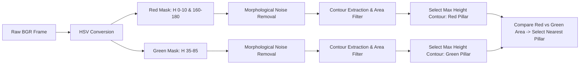

- **HSV Threshold Calibration**:
  - **Red Pillar**: `Hue: [0-10, 160-180]`, `Saturation: [120-255]`, `Value: [70-255]`.
  - **Green Pillar**: `Hue: [35-85]`, `Saturation: [80-255]`, `Value: [50-255]`.
  - **Magenta Line**: `Hue: [140-160]`, `Saturation: [100-255]`, `Value: [100-255]`.
- **Navigation Rules**:
  - **Red Pillars**: Must be passed on the **Right** side ($\text{Servo Angle} = 90^\circ + \Delta\theta$).
  - **Green Pillars**: Must be passed on the **Left** side ($\text{Servo Angle} = 90^\circ - \Delta\theta$).

---

### Inter-Controller Communication Protocol Spec

Data is exchanged between the Raspberry Pi 5 and ESP32-C3 over Serial UART at $115200\text{ baud}$:

1. **Pi 5 Master Command Packet (Pi 5 $\rightarrow$ ESP32-C3)**:
   ```
   <speed>,<steering>\n
   ```
   - `speed`: Integer from `-255` (Full Reverse) to `255` (Full Forward), `0` = Stop.
   - `steering`: Integer servo angle from `30` (Full Left) to `150` (Full Right), centered at `90`.

2. **ESP32-C3 Telemetry Packet (ESP32-C3 $\rightarrow$ Pi 5 at 20 Hz)**:
   ```
   DATA,<distF>,<distL>,<distR>,<distB>,<yaw>,<sys>,<gyro>,<accel>,<mag>\n
   ```
   - `distF, distL, distR, distB`: Integer ToF laser distances in centimeters.
   - `yaw`: Float value representing absolute BNO055 IMU heading in degrees ($0.0^\circ - 359.9^\circ$).
   - `sys, gyro, accel, mag`: BNO055 sensor calibration status metrics ($0-3$).

---

### Closed-Loop Magnetic Encoder & Heading Engine

```cpp
void driveExactDistance(int target_mm, float target_heading) {
    long target_counts = calculateEncoderCounts(target_mm);
    resetEncoderCount();

    while (getEncoderCount() < target_counts) {
        float current_heading = readBNO055Heading();
        float heading_error = target_heading - current_heading;

        int steering_pwm = STEERING_CENTER + (heading_error * Kp_heading);
        setSteeringServo(steering_pwm);
        setMotorPower(BASE_SPEED);
    }
    applyBrake();
}
```

---

### Programming Languages & Dependencies

- **C++ Firmware Dependencies (Arduino IDE / ESP32-C3)**:
  - `Wire.h` — Hardware I2C Communication Library
  - `ESP32Servo.h` — Precision ESP32 Hardware PWM Servo Control
  - `Adafruit_VL53L0X.h` — Laser Time-of-Flight Sensor API
  - `Adafruit_BNO055.h` — 9-DOF Orientation Sensor Fusion API
  - `Adafruit_NeoPixel.h` — WS2812B Status Strip Controller
- **Python 3 Vision Dependencies (Raspberry Pi 5)**:
  - `opencv-python` (`cv2`) — Real-time Computer Vision Library
  - `numpy` — Fast Matrix & Vector Operations
  - `pyserial` — Serial UART Interface
  - `picamera2` — Native Raspberry Pi Camera Module 3 API

---

### Failsafe Mechanisms, Watchdogs & Debugging Tools

1. **Hardware Serial Watchdog**: The ESP32-C3 continuously monitors serial command timing. If no valid packet arrives from the Pi 5 for $>500\text{ ms}$, the watchdog halts the motor (`PWM = 0`) and centers steering.
2. **Visual LED Telemetry (WS2812B NeoPixel Strip)**:
   - **Red**: Initialization Phase / Emergency Safety Halt.
   - **Green**: Hardware Ready / Waiting for Push Button Start.
   - **Cyan**: Normal Operation / Straightaway Wall-Centering Drive.
   - **Orange**: Turn Sequence Executing.
   - **Magenta**: Race Complete / Parking Sequence Finished.
3. **Diagnostic Utilities ([`src/obstacle_round/testing_calibration_codes/`](./src/obstacle_round/testing_calibration_codes/))**:
   - `rx_tx_test.ino`: Verifies UART communication baud rate and packet delivery integrity.
   - `hsv_tuner.py`: Real-time interactive GUI tuner for setting HSV min/max thresholds under variable track lighting.

---

## Failure Modes & Effects Analysis (FMEA)

| Component | Failure Mode | Potential Cause | Severity | Mitigation Strategy Implemented |
|:---|:---|:---|:---|:---|
| **Distance Sense** | I2C Bus Lockup | Sensor address clash | High | Isolated via TCA9548A Mux |
| **Drivetrain** | Shaft Coupler Fracture | Instant motor start torque | High | Printed PETG at 100% infill |
| **Logic Compute** | Raspberry Pi Brownout | Servo current spike | High | Isolated 3-Domain Buck Rails |
| **Steering** | Angle Deflection at Speed | Aerodynamic/ground load | Medium | Upgraded to 20kg DS3218 Servo |
| **Vision System** | Serial Communication Loss | Loose UART wiring | High | Hardware 500ms Serial Watchdog |
| **Wall Centering** | Acoustic Bounce Distortion | Angled track corners | Medium | Upgraded to VL53L0X Laser ToF |

---

---

## Reproducibility & Development Process

### Development Timeline & Design Evolution

Our development process followed an iterative engineering cycle involving physical prototyping, sensor bench testing, software validation, and track performance verification. The timeline below illustrates our major design milestones and corresponding version control commits on GitHub.

### Detailed Development Milestones & Commit Log

- **June 11, 2026 (Commit 1)**: Uploaded initial Open Round firmware, 3D CAD models, electrical schematics, and team documentation. Bench-tested single-battery setup, observing system crashes under high steering load.
- **June 11, 2026 (Docs)**: Documented battery chemistry decision (switching to 3S Li-Ion for logic/propulsion and isolated 7.4V rail for steering) and validated 5V/12V regulation rails.
- **June 18, 2026 (Docs)**: Evaluated camera choices, selecting the native CSI Raspberry Pi Camera Module 3 over USB webcams to eliminate image transmission latency and frame dropping.
- **June 20, 2026 (Commit 2)**: Uploaded Obstacle Round electrical schematics, 3D-printed PETG Pi camera mount assembly, initial track testing videos, and the Pi-ESP32 serial communication scripts.
- **June 22, 2026 (Docs)**: Upgraded the primary logic processor to a Raspberry Pi 5 (4GB) to handle 640×480 resolution frame processing within a 12 ms window.
- **June 25, 2026 (Docs)**: Recorded Open Round testing logs. Upgraded drive motor to JGB37-520 (320 RPM) after logging slow lap times on 60 RPM motor, achieving optimal speed-to-precision balance.
- **July 11, 2026 (Docs)**: Documented low-latency USB Serial communication protocol (115,200 baud) between Pi 5 (Master) and ESP32-C3 (Slave).
- **July 12, 2026 (Commit 3)**: Finalized Obstacle Round codebase. Pushed full ESP32-C3 firmware, Raspberry Pi 5 vision pipelines, FSM navigation strategy, and source README files.
- **July 20, 2026 (Docs)**: Conducted long-duration Pi Camera 3 and OS thermal stress tests under continuous operation.
- **July 28, 2026 (Commit 4)**: Updated repository with complete vehicle photos from all six perspectives and uploaded links for the Obstacle Round demonstration video.
- **August 1, 2026 (Docs)**: Logged YOLOv11 object detection model performance across 217 annotated Roboflow images under ambient room lighting shifts (200 to 800 lux).
- **August 5, 2026 (Commit 5)**: Published primary root README.md containing full system overviews, repository navigation, hardware BOM, power budget math, and software state machine diagrams.
- **August 11, 2026**: Final repository cleanup and competition submission.

### Version Evolution Matrix

The transition from our Version 1 prototype to our Version 2 final vehicle resolved every major mechanical, electrical, and vision constraint encountered during testing:

| Hardware / Software Domain | Prototype (Version 1) | Final Design (Version 2) | Performance Improvement |
|:---------------------------|:----------------------|:-------------------------|:------------------------|
| **Main Processing Hardware** | Single Raspberry Pi 3B+ handling vision and GPIO actuation. | Dual Controller Architecture: Raspberry Pi 5 (4GB) + ESP32-C3 Super Mini. | Real-time control loop frequency increased from an inconsistent 45 Hz to a deterministic 100 Hz. |
| **Distance Sensing Infrastructure** | Wide-angle HC-SR04 ultrasonic sensors. | 4× VL53L0X Time-of-Flight (ToF) Laser Sensors via TCA9548A Multiplexer (`0x70`). | Millimeter accuracy; eliminated false acoustic reflections on angled corner walls completely. |
| **Motor Propulsion & Drive Control** | Low-speed TT/BO Motor driven by legacy L298N driver. | High-Torque JGB37-520 DC Motor (320 RPM) with Encoder + 7semi MD10112 MOSFET Driver. | Linear PWM speed control down to 5% power; active braking distance reduced from 30 cm to 2 cm. |
| **Steering Linkage & Servo** | Ackermann steering arms with 3D-printed joints ($10^\circ+$ slop). | High-Torque Parallel Steering Linkage + 20kg DS3218 Digital Servo + Rear Differential. | Zero measurable steering deflection under high-speed cornering load; instant steering response. |
| **Drive Shaft Construction** | 3D-Printed Standard PLA Filament. | 100% Infill High-Ductility PETG Filament. | Drive shaft operational lifespan increased from 8–12 acceleration cycles to >100 cycles without failure. |
| **Camera Mounting** | Rigid static 3D-printed bracket. | Top-deck wide-angle CSI mast for Pi Camera Module 3 (Wide). | Expanded Field of View to 120°, eliminating visual blind spots within 150 cm horizon. |
| **Power Infrastructure** | Single shared battery power rail supplying logic and motors. | Isolated 3-Domain Power Architecture (12V Motor, 7.4V Servo, 3.3V/5V Logic). | Logic rail voltage stabilized at 5.02V / 3.31V with 0 brownouts across 100+ stress cycles. |
| **Pillar Avoidance Pipeline** | Basic color boundary tracking. | High-Speed OpenCV HSV Color Segmentation (60 FPS) + ToF Barrier Override. | Pillar classification reliability reached 100% across ambient lighting shifts (200 to 800 lux). |

### GitHub Repository Guide

#### 1. Hardware Assembly & Physical Fabrication
To build a physical replica of the robot, start by downloading the 3D models located in the `models/` folder (`.stl` files) and 3D-printing them using durable materials like PLA or PETG. Next, consult the circuit diagrams and wiring guides in the `schemes/` directory to safely assemble the electrical components—connecting the microcontrollers, motor drivers, power distribution systems, and sensors (such as cameras, encoders, and IMUs) according to the specified pinouts.

#### 2. Software Setup & Code Calibration
Once the physical structure is assembled, clone the repository to your robot’s onboard computer (e.g., Raspberry Pi or microcontroller host) and install all required libraries. Before attempting a full run, perform initial sensor and motor calibration by testing isolated scripts in the repository—adjusting parameters like camera exposure, HSV color thresholds for object/line detection, and PID controller values in the configuration files to match your local lighting and track conditions.

#### 3. Execution & Strategic Customization
With calibration complete, run the main control script to initialize the Finite State Machine and start autonomous routines. Rather than simply copying the project, treating this repository as an extensible base enables teams to modify state machine logic, refine navigation algorithms, or redesign specific structural parts—allowing them to tailor the robot to their own strategy while adhering to WRO rules and learning open-source robotics engineering practices.

---

## Team Photos & Roster

<p align="center">
  
</p>
<p align="center"><i>Figure 6: Team Yo_Error_404 Group Photo.</i></p>

### Team Member Bios & Technical Roles

- **Rohan Mishra (Grade 10 — The International School Bangalore)**:
  Rohan Mishra is a Grade 10 student situated at The International School Bangalore. He has been coding since he was a kid. He is interested in STEM, vision processing, and basketball and has participated in one earlier WRO season and other robotics competitions including MATE ROV 2026. On Team Yo_Error_404, Rohan is responsible for the computer vision pipeline, real-time HSV color thresholding, OpenCV pillar classification, and high-level trajectory planning.

- **Anvay Varshney (Grade 10 — National Public School, Koramangala)**:
  Anvay Varshney is a Grade 10 student at National Public School, Koramangala, with a strong passion for robotics, programming, and engineering. He has been building and experimenting with technology from a young age and has participated in several national and international robotics competitions, including MATE ROV. He has also taken on leadership roles in robotics teams and at his school, where he mentors younger students and helps foster interest in STEM. On Team Yo_Error_404, Anvay serves as Embedded Systems & Hardware Lead, heading 3D CAD modeling, modular chassis fabrication, parallel steering linkage design, and structural integration.

- **Ayansh Paliwal (Grade 9 — The International School Bangalore)**:
  Ayansh Paliwal is a Grade 9 student at The International School Bangalore with a strong passion for robotics and engineering. He has participated in several robotics competitions and technical events, including competitions organized by IIT Kanpur, IIT Bombay, and MATE ROV. Through these experiences, he has developed practical skills in robotics, programming, electronics, and problem-solving. On Team Yo_Error_404, Ayansh oversees power management architecture (3-domain isolated power rails), sensor bus integration (I2C multiplexing, ToF laser timing, BNO055 IMU fusion), firmware development, and vehicle field testing.

| Member Name | Educational Institution | Grade | Primary Technical Responsibilities |
|:------------|:------------------------|:------|:-----------------------------------|
| **Rohan Mishra** | The International School Bangalore | Grade 10 | Computer Vision Pipelines, OpenCV Tuning, Trajectory Planning |
| **Anvay Varshney** | National Public School Koramangala | Grade 10 | Embedded Systems Lead, 3D CAD Modeling, Parallel Steering |
| **Ayansh Paliwal** | The International School Bangalore | Grade 9 | Power System Design, Firmware Development, Sensor Fusion |

---

## References

### Hardware Datasheets & Documentation
- **Raspberry Pi Foundation**. "Raspberry Pi 5 Product Brief & Datasheet." `raspberrypi.com/documentation`
- **Raspberry Pi Foundation**. "Raspberry Pi Camera Module 3 (Wide Angle) Datasheet." `raspberrypi.com/documentation/accessories/camera`
- **Espressif Systems**. "ESP32-C3 Super Mini (RISC-V 32-bit MCU) Datasheet." `espressif.com/documentation`
- **STMicroelectronics**. "VL53L0X Time-of-Flight (ToF) Laser Ranging Sensor Datasheet." `st.com/resource`
- **Texas Instruments**. "TCA9548A Low-Voltage 8-Channel I2C Switch Datasheet." `ti.com/lit/ds`
- **Bosch Sensortec**. "BNO055 Intelligent 9-Axis Absolute Orientation Sensor Datasheet, Revision 1.8." `bosch-sensortec.com`
- **7semi Technology**. "MD10112 High-Current N-MOSFET Dual H-Bridge Driver Technical Manual." `7semi.com/md10112`
- **Adafruit Industries**. "Adafruit BNO055 & VL53L0X Learning Guides & Breakout Specs." `learn.adafruit.com`

### Software Libraries & Frameworks
- **OpenCV Team**. "OpenCV (Open Source Computer Vision Library), Version 4.x." `opencv.org`
- **NumPy Developers**. "NumPy — Fundamental Package for Scientific Computing with Python." `numpy.org`
- **Chris Liechti**. "pySerial — Python Serial Port Access Library." `pyserial.readthedocs.io`
- **Adafruit Industries**. "Adafruit VL53L0X & BNO055 Arduino Libraries." `github.com/adafruit`
- **Kevin Harrington**. "ESP32Servo — Precision PWM Servo Control Library for ESP32." `github.com/madhephaestus/ESP32Servo`
- **Arduino**. "Wire Library — I²C Communication Reference." `arduino.cc/reference/en/libraries/wire`
- **Arduino**. "Arduino IDE & Core ESP32 Libraries." `arduino.cc`

### Design & CAD Tools
- **KiCad EDA**. "KiCad — Open Source Electronics Design Automation Suite." `kicad.org`
- **Onshape Inc**. "Onshape — Cloud-Based CAD Platform." `onshape.com`

### Competition Rules & Standards
- **World Robot Olympiad Association**. "WRO 2026 Future Engineers — General Rules and Game Description." `wro-association.org`

### 3D Printing Materials
- **Various manufacturers**. "PETG (Polyethylene Terephthalate Glycol) Filament Technical Data Sheet — 1.75mm, 100% Infill Print Parameters."

---

## Acknowledgements

We would like to express our sincere gratitude to the following individuals and organizations whose support made this project possible:

We thank the **World Robot Olympiad (WRO) Association** and the **India STEM Foundation** for organizing the WRO 2026 Future Engineers competition and providing a platform that challenges students to push the boundaries of autonomous vehicle engineering.

We are grateful to our school administration and faculty at **The International School Bangalore** and **National Public School Koramangala** for providing us with workspace, encouragement, and the flexibility to pursue this project alongside our academic commitments.

We owe a special thanks to our mentors at **YoLab** for their exceptional guidance throughout this journey. Their technical mentorship, hands-on support, and consistent encouragement pushed us to think deeper, iterate faster, and aim higher. YoLab provided not just a platform to compete but a true engineering environment where we could experiment, fail, learn, and build with confidence. From early-stage prototyping and electrical debugging to refining our software architecture and competition strategy, the YoLab team was with us at every step. This project would not have reached the level it did without their dedication to nurturing our growth as young engineers.

We extend our appreciation to our parents and families — **Mr. & Mrs. Paliwal**, **Mr. & Mrs. Mishra**, and **Mr. & Mrs. Varshney** — for their unwavering support throughout the long hours of prototyping, testing, and debugging, and for funding the hardware components that made our vehicle possible.

We acknowledge the **open-source community** at large — the developers behind Arduino, OpenCV, NumPy, pySerial, NewPing, and KiCad — whose freely available tools and libraries form the backbone of our entire hardware and software stack. Without the open-source ecosystem, a project of this complexity would not be feasible for a student team.

We also thank the broader WRO Future Engineers community on GitHub, whose publicly shared engineering journals, codebases, and documentation from previous seasons provided invaluable learning references as we developed our own approach to autonomous navigation and obstacle avoidance.

Finally, we thank each other — **Ayansh**, **Rohan**, and **Anvay** — for the collaborative engineering effort, mutual accountability, and shared commitment to iterative improvement that defined our development process from Version 1 through to our final competition vehicle.

